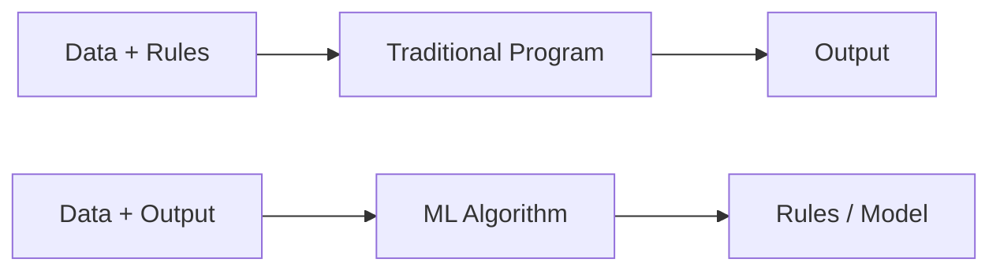

# Unit I — Foundations of Machine Learning

[⬅ Back to Index](README.md)

**In this unit:** what ML is → why we need it → types of learning → challenges → how we measure a model's error → ERM → inductive bias → PAC learning.

---

## 1. What is Machine Learning?

> 💡 **In simple words:** Instead of writing rules by hand, we show the computer many examples and let it figure out the rules itself.

**Arthur Samuel (1959):** ML gives computers the ability to learn without being explicitly programmed.

**Tom Mitchell (1997):** A program **learns** from experience **E** for a task **T** with performance measure **P**, if its performance on T (measured by P) improves with E.

| Example | Task (T) | Performance (P) | Experience (E) |
|---|---|---|---|
| Spam filter | Mark emails spam / not spam | % correctly marked | Emails labelled by users |
| Chess program | Play chess | % games won | Games played |
| Digit recognition | Read handwritten digits | Accuracy | Labelled digit images |

**Traditional programming vs ML**



---

## 2. Why Do We Need ML? (Need & Scope)

**Need:**
1. Some tasks are too hard to write rules for (recognising faces, understanding speech).
2. Data is too large for humans to analyse (web logs, genome data).
3. Things change over time (new spam tricks) — a model can simply be retrained.
4. Personalisation for millions of users (recommendations).

**Scope (where ML is used):**

| Field | Applications |
|---|---|
| Healthcare | Disease prediction, reading X-rays |
| Finance | Fraud detection, credit scoring |
| Shopping | Recommendations, demand forecasting |
| Language | Translation, chatbots |
| Vision | Face unlock, self-driving cars |
| Agriculture | Crop yield prediction |

---

## 3. Types of Learning

### 3.1 Supervised Learning
> 💡 Learning **with a teacher** — every example comes with the correct answer.

Data: pairs $(x_1, y_1), (x_2, y_2), \dots, (x_m, y_m)$. Goal: learn $h$ so that $h(x) \approx y$.

- **Classification** → output is a category (spam / not spam).
- **Regression** → output is a number (house price).

### 3.2 Unsupervised Learning
> 💡 Learning **without a teacher** — only inputs, no answers. Find hidden patterns.

- **Clustering** (group similar customers), **dimensionality reduction** (PCA), **association rules** (bread → butter).

### 3.3 Reinforcement Learning
> 💡 Learning by **trial and error** — the agent takes actions and gets rewards or penalties.

Example: a robot learning to walk, a program learning to play a game. (Full details in Unit V.)

### 3.4 Comparison

| | Supervised | Unsupervised | Reinforcement |
|---|---|---|---|
| Data | Inputs + correct answers | Only inputs | Rewards from actions |
| Goal | Predict the answer | Find groups / patterns | Maximise total reward |
| Example | Spam detection | Customer groups | Game playing |
| Algorithms | Decision Tree, SVM | K-Means, PCA | Q-Learning |

---

## 4. Challenges in Machine Learning

| Challenge | What it means | Fix |
|---|---|---|
| Not enough data | Model can't learn patterns | Collect more, data augmentation |
| Poor-quality data | Noise, missing values, wrong labels | Clean the data |
| Non-representative data | Training data ≠ real world | Better sampling |
| Irrelevant features | Useless inputs confuse the model | Feature selection |
| **Overfitting** | Memorises training data, fails on new data | Simpler model, more data, regularization |
| **Underfitting** | Too simple to learn the pattern | More complex model, better features |
| Curse of dimensionality | Too many features → data becomes sparse | Reduce features (PCA) |
| Class imbalance | e.g. 99% normal, 1% fraud | Resampling, better metrics |

---

## 5. Statistical Learning Framework

> 💡 **In simple words:** This is the "mathematical setup" of learning. Nature has some hidden rule that generates data. We see only a sample. We pick a model and measure how wrong it is.

| Term | Meaning |
|---|---|
| Domain $\mathcal{X}$ | All possible inputs |
| Labels $\mathcal{Y}$ | All possible outputs, e.g. $\lbrace 0, 1 \rbrace$ |
| Distribution $\mathcal{D}$ | The unknown process that generates data |
| Training set $S$ | The $m$ examples we actually have |
| Hypothesis $h$ | Our model (a function from $\mathcal{X}$ to $\mathcal{Y}$) |
| Hypothesis class $\mathcal{H}$ | The set of models we are allowed to choose from |

**Assumption:** examples are **i.i.d.** — independent and drawn from the same distribution.

### 5.1 Loss Function — "how wrong is one prediction?"

**0–1 loss** (classification): 0 if correct, 1 if wrong.

```math
\ell(h, (x, y)) = \begin{cases} 0 & \text{if } h(x) = y \\ 1 & \text{if } h(x) \neq y \end{cases}
```

**Squared loss** (regression):

```math
\ell(h, (x, y)) = (h(x) - y)^2
```

### 5.2 Two Kinds of Error

**True risk** — error on *all possible* data (what we really care about, but can't compute):

```math
L_{\mathcal{D}}(h) = \mathbb{E}_{(x,y)\sim\mathcal{D}}\left[\ell(h, (x, y))\right]
```

**Empirical risk** — average error on the *training data* (this we can compute):

```math
L_S(h) = \frac{1}{m}\sum_{i=1}^{m}\ell(h, (x_i, y_i))
```

- $m$ = number of training examples, $\sum$ = add up the loss for every example.

### 📝 Example 5.1 — Empirical Risk (0–1 loss)

| Example | 1 | 2 | 3 | 4 | 5 | 6 | 7 | 8 |
|---|---|---|---|---|---|---|---|---|
| True $y$ | 1 | 0 | 1 | 1 | 0 | 0 | 1 | 0 |
| Predicted | 1 | 0 | **0** | 1 | 0 | **1** | 1 | 0 |

Wrong at examples 3 and 6.

```math
L_S(h) = \frac{2}{8} = 0.25 \qquad \text{(Accuracy} = 75\%\text{)}
```

### 📝 Example 5.2 — Empirical Risk (squared loss)

Predictions $(2.5, 3, 4.5, 6)$, true values $(3, 3, 5, 5)$:

```math
L_S = \frac{(2.5-3)^2 + (3-3)^2 + (4.5-5)^2 + (6-5)^2}{4} = \frac{0.25 + 0 + 0.25 + 1}{4} = 0.375
```

---

## 6. Empirical Risk Minimization (ERM)

> 💡 **In simple words:** Since we can't compute the true error, pick the model with the **lowest training error**.

```math
h_S = \arg\min_{h \in \mathcal{H}} L_S(h)
```

($\arg\min$ means "the $h$ that gives the minimum value".)

### The Problem: ERM Can Overfit

Imagine a "model" that simply **memorises** the training data: for a seen input it returns the stored answer, for anything new it says 0.
- Training error = **0** ✅ (ERM loves it)
- Error on new data = **very high** ❌

**Fix:** don't allow *every* possible model. Choose a limited class $\mathcal{H}$ (like "only straight lines") **before** seeing the data. This restriction is called **inductive bias**.

---

## 7. Inductive Bias

> 💡 **In simple words:** The assumptions a learning algorithm makes so it can make guesses about **new, unseen** data.

Without any assumptions, learning is impossible — any guess for unseen data would be equally valid (**No Free Lunch theorem**).

| Algorithm | Its inductive bias (assumption) |
|---|---|
| Linear regression | Relationship is a straight line |
| KNN | Nearby points have similar labels |
| Decision tree | Shorter trees are better |
| Naïve Bayes | Features are independent given the class |
| SVM | The widest-margin boundary is best |

**Two types:**
- **Restriction bias** — limits which models are possible (e.g. only lines).
- **Preference bias** — prefers some models over others (e.g. prefer shorter trees).

**The trade-off:**
- Class too **small** → can't fit the pattern → **underfitting**.
- Class too **large** → fits noise → **overfitting**.

---

## 8. PAC Learning (Probably Approximately Correct)

> 💡 **In simple words:** We can't guarantee a *perfect* model from limited data. PAC asks: how many examples do we need so that the model is **approximately correct** (error ≤ ε) with **high probability** (at least 1 − δ)?

| Symbol | Meaning | Typical value |
|---|---|---|
| $\epsilon$ (epsilon) | Maximum error we accept ("approximately correct") | 0.05 = 5% |
| $\delta$ (delta) | Chance of failure we accept ("probably") | 0.01 → 99% confidence |
| $\lvert\mathcal{H}\rvert$ | Number of models in the class | |
| $m$ | Number of training examples needed | |

### 8.1 Sample Complexity (finite class, a perfect model exists)

```math
m \geq \frac{1}{\epsilon}\left(\ln|\mathcal{H}| + \ln\frac{1}{\delta}\right)
```

**What it tells us:**
- Want smaller error (↓ε) → need **more** data.
- Want more confidence (↓δ) → need a bit more data (only logarithmic, so it's cheap).
- Bigger model class → need more data.

### 8.2 Agnostic PAC (no perfect model exists — noisy data)

```math
m \geq \frac{2}{\epsilon^2}\ln\frac{2|\mathcal{H}|}{\delta}
```

Notice $\epsilon^2$ instead of $\epsilon$ — noisy data needs **much more** data.

### 📝 Example 8.1 — How Many Examples?

$\lvert\mathcal{H}\rvert = 1000$, error ≤ 5% ($\epsilon = 0.05$), confidence 99% ($\delta = 0.01$).

```math
m \geq \frac{1}{0.05}\left(\ln 1000 + \ln 100\right) = 20\,(6.908 + 4.605) = 20 \times 11.513 = 230.3
```

**Answer:** $m = 231$ examples (always round **up**).

### 📝 Example 8.2 — Same Question, Agnostic Case

```math
m \geq \frac{2}{(0.05)^2}\ln\frac{2 \times 1000}{0.01} = \frac{2}{0.0025}\ln(200000) = 800 \times 12.206 = 9764.9
```

**Answer:** $m = 9765$ — about 42× more than the realizable case.

### 📝 Example 8.3 — Boolean Conjunctions

Models like $x_1 \wedge \neg x_3$ over $n = 10$ variables. Each variable can appear as $x$, as $\neg x$, or not at all → $\lvert\mathcal{H}\rvert = 3^{10}$. Take $\epsilon = 0.1$, $\delta = 0.05$:

```math
m \geq \frac{1}{0.1}\left(10\ln 3 + \ln 20\right) = 10\,(10.986 + 2.996) = 139.8 \Rightarrow 140
```

<details>
<summary>📘 Optional: Where does the PAC formula come from?</summary>

A "bad" model has error > ε, so it matches one random example with probability at most $1-\epsilon$. It matches all $m$ examples with probability at most $(1-\epsilon)^m \leq e^{-\epsilon m}$. There are at most $\lvert\mathcal{H}\rvert$ bad models, so:

```math
P(\text{some bad model looks perfect}) \leq |\mathcal{H}|\,e^{-\epsilon m}
```

Set this $\leq \delta$ and solve for $m$ → you get the formula in 8.1.

</details>

---

## ✅ Quick Revision

| Concept | Formula / Key point |
|---|---|
| Mitchell's definition | Learn from E for task T, measured by P |
| 0–1 loss | 0 if correct, 1 if wrong |
| Squared loss | $(h(x) - y)^2$ |
| True risk | $L_{\mathcal{D}}(h) = \mathbb{E}[\ell]$ (can't compute) |
| Empirical risk | $L_S(h) = \frac{1}{m}\sum \ell$ (training error) |
| ERM | Pick $h$ with the lowest training error |
| Inductive bias | Assumptions needed to generalise |
| PAC (realizable) | $m \geq \frac{1}{\epsilon}\left(\ln\lvert\mathcal{H}\rvert + \ln\frac{1}{\delta}\right)$ |
| PAC (agnostic) | $m \geq \frac{2}{\epsilon^2}\ln\frac{2\lvert\mathcal{H}\rvert}{\delta}$ |

**Likely exam questions:** Define ML with T, P, E · Compare supervised / unsupervised / RL · Why is inductive bias necessary? · Explain ERM and why it can overfit · Numerical on PAC sample size.

---

[⬅ Back to Index](README.md) | [Next: Unit II ➡](Unit-2-Classification.md)
