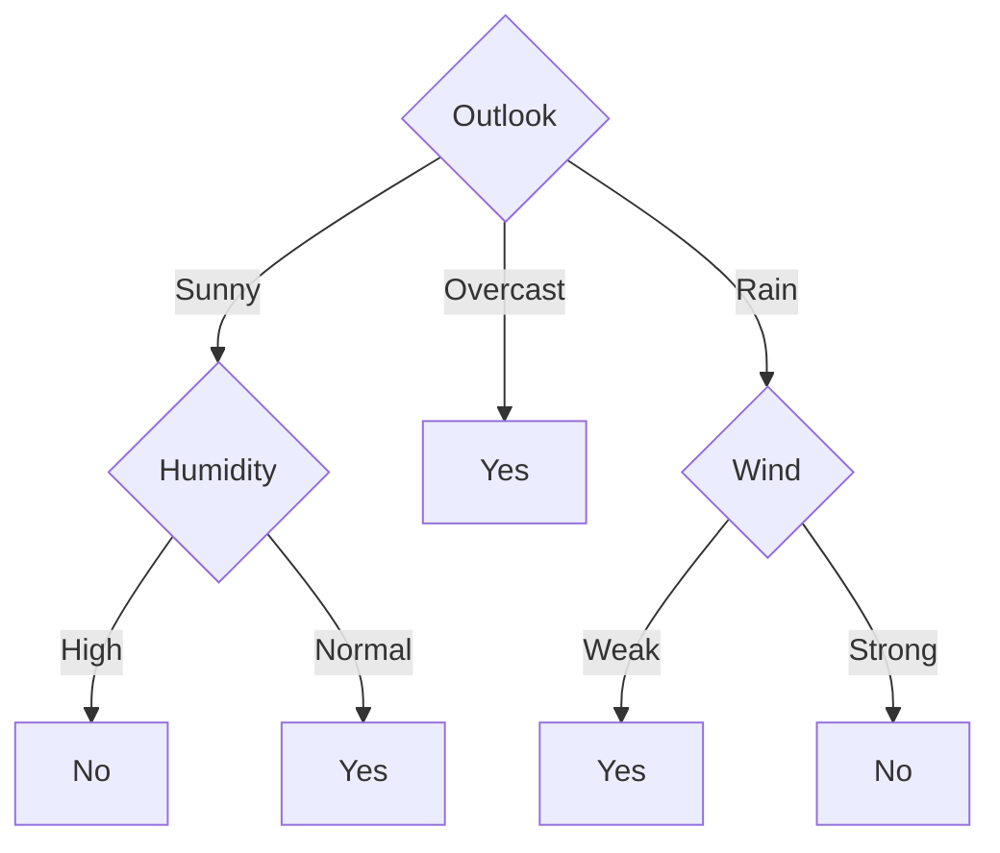
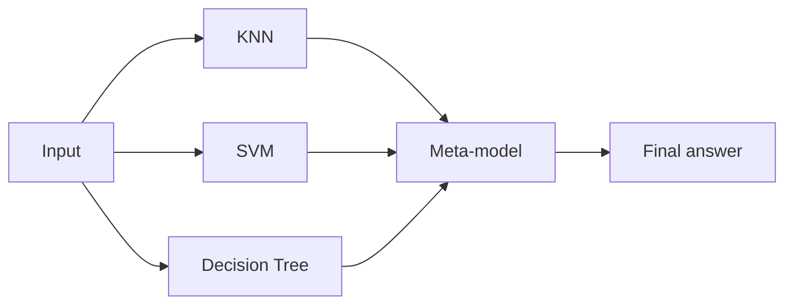

# Unit III — Non-parametric Classification & Ensemble Models

[⬅ Back to Index](README.md)

**In this unit:** KNN → decision trees (entropy, information gain, Gini) → ID3, C4.5, CART → pruning → ensembles (bagging, boosting, stacking, voting).

---

## 0. Parametric vs Non-parametric

> 💡 **Parametric** models have a fixed number of parameters (e.g. a line has 2). **Non-parametric** models grow with the data (KNN stores every example; a tree grows more branches).

| | Parametric | Non-parametric |
|---|---|---|
| Examples | Linear/Logistic Regression, Naïve Bayes | KNN, Decision Trees |
| Assumption about data | Strong | Very few |
| Flexibility | Low (may underfit) | High (may overfit) |

---

## 1. K-Nearest Neighbours (KNN)

> 💡 **In simple words:** "Tell me who your neighbours are, and I'll tell you who you are." To classify a new point, look at the $k$ closest training points and take a **majority vote**.

### 1.1 Algorithm
1. Choose $k$.
2. Find the distance from the new point to **every** training point.
3. Pick the $k$ nearest.
4. **Classification:** majority vote. **Regression:** average of their values.

KNN is a **lazy learner** — no training; all the work happens at prediction time.

### 1.2 Distance Formulas

```math
\text{Euclidean: } d = \sqrt{(x_1 - z_1)^2 + (x_2 - z_2)^2 + \dots}
```

```math
\text{Manhattan: } d = |x_1 - z_1| + |x_2 - z_2| + \dots
```

```math
\text{Minkowski: } d = \left(\sum_j |x_j - z_j|^p\right)^{1/p} \quad (p = 1 \text{ Manhattan}, p = 2 \text{ Euclidean})
```

**Weighted KNN** — closer neighbours count more:

```math
w_i = \frac{1}{d_i^2}
```

### 1.3 Choosing k and Scaling
- **Small $k$** (like 1) → sensitive to noise → **overfitting**.
- **Large $k$** → too smooth → **underfitting**.
- Choose $k$ using cross-validation; use an **odd** $k$ for 2 classes to avoid ties.
- **Always scale features** (otherwise a feature like salary in lakhs dominates age in years):

```math
x' = \frac{x - x_{\min}}{x_{\max} - x_{\min}}
```

| Pros | Cons |
|---|---|
| Simple, no training | Slow prediction on big data |
| Works for any shape of boundary | Needs feature scaling |
| Handles many classes | Poor with many features (curse of dimensionality) |

### 📝 Example 1.1 — KNN Classification

| Point | $x_1$ | $x_2$ | Class |
|---|---|---|---|
| P1 | 1 | 2 | A |
| P2 | 2 | 3 | A |
| P3 | 3 | 1 | A |
| P4 | 5 | 5 | B |
| P5 | 7 | 7 | B |
| P6 | 8 | 6 | B |

Classify $\mathbf{q} = (4, 4)$.

| Point | Calculation | Distance | Rank |
|---|---|---|---|
| P1 | $\sqrt{3^2 + 2^2} = \sqrt{13}$ | 3.61 | 4 |
| P2 | $\sqrt{2^2 + 1^2} = \sqrt{5}$ | 2.24 | 2 |
| P3 | $\sqrt{1^2 + 3^2} = \sqrt{10}$ | 3.16 | 3 |
| P4 | $\sqrt{1^2 + 1^2} = \sqrt{2}$ | 1.41 | 1 |
| P5 | $\sqrt{3^2 + 3^2} = \sqrt{18}$ | 4.24 | 5 |
| P6 | $\sqrt{4^2 + 2^2} = \sqrt{20}$ | 4.47 | 6 |

- **$k = 1$:** nearest is P4 → **B**
- **$k = 3$:** P4 (B), P2 (A), P3 (A) → A wins 2–1 → **A**
- **Weighted $k = 3$:** B $= 1/2 = 0.5$; A $= 1/5 + 1/10 = 0.3$ → **B**

The answer depends on $k$ and weighting!

### 📝 Example 1.2 — KNN Regression

Sizes and prices: (8, 40), (10, 50), (12, 55), (15, 70), (20, 90). Predict for size 11 with $k = 3$.
Nearest sizes: 10, 12, 8 →

```math
\hat{y} = \frac{50 + 55 + 40}{3} = 48.33
```

---

## 2. Decision Trees

> 💡 **In simple words:** A tree of **yes/no questions**. Start at the top (root), answer a question, follow the branch, and repeat until you reach a leaf that gives the answer.

- **Root node:** first (best) question.
- **Internal node:** a question on one feature.
- **Leaf node:** final answer (class).
- Every path from root to leaf is an **IF–THEN rule**.

**How it is built (greedy):** at each node, pick the feature that splits the data **best** (makes the groups most "pure"), then repeat for each branch. Stop when a node is pure or no features are left.

---

## 3. How to Pick the Best Split

### 3.1 Entropy — "how mixed is this group?"

```math
H(S) = -\sum_{i} p_i\log_2 p_i
```

($p_i$ = fraction of class $i$ in the group.)

- All one class → $H = 0$ (pure).
- 50–50 mix → $H = 1$ (most mixed, for 2 classes).

### 3.2 Information Gain (used by ID3)

How much entropy **drops** after splitting on feature $A$:

```math
\text{Gain}(S, A) = H(S) - \sum_{v}\frac{|S_v|}{|S|}H(S_v)
```

($S_v$ = the examples where $A$ has value $v$; $\frac{|S_v|}{|S|}$ = fraction of examples going to that branch.)

**Pick the feature with the highest gain.**

**Problem:** Gain favours features with many values (e.g. "Day number" gives a perfect but useless split).

### 3.3 Gain Ratio (used by C4.5) — fixes that problem

```math
\text{SplitInfo}(S, A) = -\sum_v\frac{|S_v|}{|S|}\log_2\frac{|S_v|}{|S|} \qquad \text{GainRatio} = \frac{\text{Gain}}{\text{SplitInfo}}
```

### 3.4 Gini Index (used by CART)

```math
\text{Gini}(S) = 1 - \sum_i p_i^2
```

Pure → 0; 50–50 → 0.5. **Pick the split with the lowest weighted Gini.**

| Class fraction $p$ | Entropy | Gini |
|---|---|---|
| 0 (pure) | 0 | 0 |
| 0.1 | 0.47 | 0.18 |
| 0.3 | 0.88 | 0.42 |
| 0.5 (mixed) | 1.00 | 0.50 |

---

## 4. ID3 Algorithm

- By Ross Quinlan. Uses **Information Gain**.
- Only **categorical** features. One branch per value. No pruning.

### 📝 Example 4.1 — Build a Tree for Play Tennis

(Use the 14-day Play Tennis table from Unit II: 9 Yes, 5 No.)

**Step 1 — Entropy of whole data:**

```math
H(S) = -\frac{9}{14}\log_2\frac{9}{14} - \frac{5}{14}\log_2\frac{5}{14} = 0.410 + 0.530 = 0.940
```

**Step 2 — Gain of Outlook** (worked fully):

| Outlook | Yes | No | Entropy |
|---|---|---|---|
| Sunny (5) | 2 | 3 | $-\frac{2}{5}\log_2\frac{2}{5} - \frac{3}{5}\log_2\frac{3}{5} = 0.971$ |
| Overcast (4) | 4 | 0 | 0 |
| Rain (5) | 3 | 2 | 0.971 |

```math
\text{Gain(Outlook)} = 0.940 - \left[\frac{5}{14}(0.971) + \frac{4}{14}(0) + \frac{5}{14}(0.971)\right] = 0.940 - 0.694 = 0.246
```

**Same method for the others:**

| Feature | Branch entropies | Gain |
|---|---|---|
| **Outlook** | 0.971, 0, 0.971 | **0.246** ← highest |
| Humidity | High (3Y,4N) = 0.985; Normal (6Y,1N) = 0.592 | 0.151 |
| Wind | Weak (6Y,2N) = 0.811; Strong (3Y,3N) = 1.0 | 0.048 |
| Temperature | Hot = 1.0; Mild = 0.918; Cool = 0.811 | 0.029 |

→ **Outlook is the root.**

**Step 3 — Overcast** branch is all Yes → leaf **Yes**.

**Step 4 — Sunny branch** (Days 1, 2, 8, 9, 11 → 2 Yes, 3 No, $H = 0.971$):
- Humidity: High = {No, No, No}, Normal = {Yes, Yes} → both pure → Gain = **0.971** ✅
- Temperature: Gain = 0.571; Wind: Gain = 0.020

→ split on **Humidity**.

**Step 5 — Rain branch** (Days 4, 5, 6, 10, 14 → 3 Yes, 2 No):
- Wind: Weak = {Yes, Yes, Yes}, Strong = {No, No} → Gain = **0.971** ✅

→ split on **Wind**.

**Final tree:**



---

## 5. C4.5 Algorithm

Improved version of ID3:
1. Uses **Gain Ratio** (not biased toward many-valued features).
2. Handles **numeric** features (finds the best threshold).
3. Handles **missing values**.
4. Does **pruning** after building the tree.

### 📝 Example 5.1 — Gain Ratio of Outlook

Branch sizes 5, 4, 5 out of 14:

```math
\text{SplitInfo} = -\frac{5}{14}\log_2\frac{5}{14} - \frac{4}{14}\log_2\frac{4}{14} - \frac{5}{14}\log_2\frac{5}{14} = 0.530 + 0.516 + 0.530 = 1.577
```

```math
\text{GainRatio} = \frac{0.246}{1.577} = 0.156
```

### 📝 Example 5.2 — Numeric Feature (finding a threshold)

| Temp | 40 | 48 | 60 | 72 | 80 | 90 |
|---|---|---|---|---|---|---|
| Play | No | No | Yes | Yes | Yes | No |

Try thresholds only where the label changes: between 48–60 → **54**; between 80–90 → **85**. $H(S) = 1$ (3 Yes, 3 No).

- **Temp ≤ 54:** left {No, No} → $H = 0$; right {Y, Y, Y, N} → $H = 0.811$

```math
\text{Gain} = 1 - \frac{4}{6}(0.811) = 0.459
```

- **Temp ≤ 85:** left {N, N, Y, Y, Y} → $H = 0.971$; right {N} → $H = 0$

```math
\text{Gain} = 1 - \frac{5}{6}(0.971) = 0.191
```

**Best split: Temp ≤ 54.**

---

## 6. CART Algorithm

**Classification And Regression Trees:**
- Always **binary** splits (two branches).
- **Gini index** for classification; **squared error** for regression.
- **Cost-complexity pruning**.

### 📝 Example 6.1 — Gini for Outlook

```math
\text{Gini(whole)} = 1 - \left(\tfrac{9}{14}\right)^2 - \left(\tfrac{5}{14}\right)^2 = 0.459
```

```math
\text{Gini(Sunny)} = 1 - 0.4^2 - 0.6^2 = 0.48, \quad \text{Gini(Overcast)} = 0, \quad \text{Gini(Rain)} = 0.48
```

```math
\text{Weighted Gini} = \frac{5}{14}(0.48) + \frac{4}{14}(0) + \frac{5}{14}(0.48) = 0.343
```

Lower than Humidity (0.367), Wind (0.429), Temperature (0.440) → **Outlook** is best.

### 📝 Example 6.2 — Regression Tree Split

| $x$ | 1 | 2 | 3 | 4 | 5 | 6 |
|---|---|---|---|---|---|---|
| $y$ | 5 | 6 | 7 | 15 | 16 | 17 |

Split at $x \leq 3.5$: left mean = 6, right mean = 16.

```math
\text{Error before} = \sum(y - 11)^2 = 154 \qquad \text{Error after} = (1 + 0 + 1) + (1 + 0 + 1) = 4
```

Huge drop → great split. Leaf predictions: 6 (left), 16 (right).

### Comparison

| | ID3 | C4.5 | CART |
|---|---|---|---|
| Criterion | Info Gain | Gain Ratio | Gini / squared error |
| Splits | Multi-way | Multi-way | Binary |
| Numeric features | ❌ | ✅ | ✅ |
| Missing values | ❌ | ✅ | ✅ |
| Pruning | ❌ | ✅ | ✅ |
| Regression | ❌ | ❌ | ✅ |

---

## 7. Pruning

> 💡 **In simple words:** A fully grown tree memorises the training data (overfits). Pruning **cuts off** branches that don't really help.

### 7.1 Pre-pruning (stop early)
Stop growing when: max depth reached · too few samples in a node · gain is too small.
✅ Fast. ❌ Might stop too early.

### 7.2 Post-pruning (grow fully, then cut)
- **Reduced Error Pruning:** replace a subtree with a leaf; if accuracy on a **validation set** doesn't drop, keep the cut.
- **Cost-Complexity Pruning (CART):** balance error vs number of leaves:

```math
R_\alpha(T) = R(T) + \alpha \times (\text{number of leaves})
```

For each node, the $\alpha$ at which cutting it becomes worthwhile:

```math
\alpha_{\text{eff}} = \frac{R(\text{node as leaf}) - R(\text{subtree})}{\text{leaves in subtree} - 1}
```

**Cut the node with the smallest $\alpha_{\text{eff}}$ first** (the "weakest link").

### 📝 Example 7.1 — Cost-Complexity Pruning

| Node | Error if cut to a leaf | Error of subtree | Leaves |
|---|---|---|---|
| $t_1$ | 0.25 | 0.10 | 4 |
| $t_2$ | 0.13 | 0.10 | 2 |

```math
\alpha(t_1) = \frac{0.25 - 0.10}{4 - 1} = 0.05 \qquad \alpha(t_2) = \frac{0.13 - 0.10}{2 - 1} = 0.03
```

$t_2$ has the smaller value → **prune $t_2$ first**.

### 7.3 Preventing Overfitting (summary)

| Method | How |
|---|---|
| Pre-pruning | Limit depth, min samples per leaf |
| Post-pruning | Cut weak branches |
| Cross-validation | Choose depth / $k$ on held-out data |
| More data | Less memorising |
| Ensembles | Random Forest averages many trees |

**Sign of overfitting:** training accuracy ≈ 100% but test accuracy much lower.

---

## 8. Ensemble Models

> 💡 **In simple words:** Ask **many models** and combine their answers — like asking several doctors instead of one. The group is usually more accurate than any single member.

**Why it works:** different models make different mistakes; combining them cancels out errors.
**Needs:** each model better than random guessing, and the models should be **diverse**.

### 📝 Example 8.1 — Why Voting Helps

3 independent models, each 70% accurate. Majority vote is right if **at least 2** are right:

```math
P = \underbrace{3 \times 0.7^2 \times 0.3}_{\text{exactly 2 right}} + \underbrace{0.7^3}_{\text{all 3 right}} = 0.441 + 0.343 = 0.784
```

Accuracy improves from **70% → 78.4%**. (With 5 such models: 83.7%.)

| Method | How models are trained | How combined | Mainly reduces |
|---|---|---|---|
| Bagging | In parallel, on random samples | Vote / average | Variance (overfitting) |
| Boosting | One after another, fixing mistakes | Weighted vote | Bias (underfitting) |
| Stacking | Different model types | A "meta-model" learns to combine | Both |
| Voting | Different model types | Vote / average | Variance |

---

## 9. Bagging (Bootstrap Aggregating)

1. Make $B$ **bootstrap samples** — pick $m$ examples **with replacement** (some repeat, some are left out).
2. Train one model on each sample.
3. Combine: **majority vote** (classification) or **average** (regression).

```math
\hat{y} = \frac{1}{B}\sum_{b=1}^B f_b(x)
```

**Out-of-Bag (OOB):** chance an example is **not** picked in a bootstrap sample:

```math
\left(1 - \frac{1}{m}\right)^m \approx 0.368
```

So each model sees about **63%** of the data; the remaining ~37% can be used for testing for free.

**Random Forest** = bagging of decision trees **+** each split considers only a random subset of features ($\approx\sqrt{d}$). This makes the trees more different → better averaging.

---

## 10. Boosting

> 💡 **In simple words:** Train models **one after another**. Each new model pays **more attention to the examples the previous ones got wrong**.

### 10.1 AdaBoost Steps

1. Start with equal weights: $w_i = \frac{1}{m}$.
2. Train a weak model; find its **weighted error**:

```math
\epsilon = \text{sum of weights of misclassified examples}
```

3. Model's importance ("say"):

```math
\alpha = \frac{1}{2}\ln\left(\frac{1 - \epsilon}{\epsilon}\right)
```

4. Update weights:

```math
\text{Wrong: } w_i \leftarrow w_i \times e^{\alpha} \qquad \text{Correct: } w_i \leftarrow w_i \times e^{-\alpha}
```

   Then **normalise** (divide by the total so the weights add up to 1).

5. Repeat. Final answer:

```math
H(x) = \text{sign}\left(\sum_t \alpha_t h_t(x)\right)
```

### 📝 Example 10.1 — One Round of AdaBoost

10 examples, each weight 0.1. The first model gets 3 wrong.

**Error:** $\epsilon = 3 \times 0.1 = 0.3$

**Alpha:**

```math
\alpha = \frac{1}{2}\ln\frac{0.7}{0.3} = \frac{1}{2}\ln(2.333) = \frac{1}{2}(0.847) = 0.424
```

**New weights (before normalising):**

```math
\text{Wrong: } 0.1 \times e^{0.424} = 0.1 \times 1.528 = 0.1528 \qquad \text{Correct: } 0.1 \times e^{-0.424} = 0.1 \times 0.655 = 0.0655
```

**Total:** $3(0.1528) + 7(0.0655) = 0.458 + 0.458 = 0.917$

**Normalised:**

```math
\text{Wrong: } \frac{0.1528}{0.917} = 0.167 \qquad \text{Correct: } \frac{0.0655}{0.917} = 0.071
```

The 3 wrong examples now hold **half** of the total weight → the next model focuses on them.

### 10.2 Gradient Boosting

Each new tree is trained to predict the **leftover errors (residuals)** of the current model:

```math
F_{\text{new}}(x) = F_{\text{old}}(x) + \nu \times h(x)
```

($h$ = new tree fitted on residuals, $\nu$ = learning rate such as 0.1.) Popular versions: **XGBoost, LightGBM, CatBoost**.

### 📝 Example 10.2 — Gradient Boosting

$x = (1, 2, 3)$, $y = (3, 5, 7)$, $\nu = 0.5$.

- Start with the mean: $F_0 = 5$. Residuals $= (-2, 0, 2)$. MSE = 2.67.
- A small tree fits residuals: predicts $-2$ for $x = 1$ and $+1$ for $x = 2, 3$.
- Update: $F_1 = 5 + 0.5 \times (-2, 1, 1) = (4, 5.5, 5.5)$.
- New residuals $= (-1, -0.5, 1.5)$. MSE = **1.17** ↓

### Bagging vs Boosting

| | Bagging | Boosting |
|---|---|---|
| Training | Parallel | Sequential |
| Focus | Random samples | Previous mistakes |
| Model weights | Equal | Weighted by accuracy |
| Reduces | Variance | Bias |
| Example | Random Forest | AdaBoost, XGBoost |

---

## 11. Stacking

> 💡 Train several **different** models (KNN, SVM, tree…), then train a **meta-model** that learns how to best combine their predictions.



The base models' predictions for the meta-model are made using **cross-validation** (so the meta-model doesn't see over-confident predictions on training data).

### 📝 Example 11.1

Meta-model learned: $0.2 z_1 + 0.5 z_2 + 0.3 z_3$. Base models give $(0.6, 0.8, 0.3)$:

```math
0.2(0.6) + 0.5(0.8) + 0.3(0.3) = 0.12 + 0.40 + 0.09 = 0.61 \Rightarrow \text{Class 1}
```

---

## 12. Voting and Averaging

| Method | Formula |
|---|---|
| **Hard voting** | Most common predicted class |
| **Soft voting** | Average the probabilities, pick the highest: $\hat{y} = \arg\max_c \frac{1}{M}\sum_j P_j(c)$ |
| **Averaging** (regression) | $\hat{y} = \frac{1}{M}\sum_j f_j(x)$ |
| **Weighted averaging** | $\hat{y} = \sum_j w_j f_j(x)$, with $\sum_j w_j = 1$ |

### 📝 Example 12.1 — Hard vs Soft Voting

Three models give P(class 1) = 0.90, 0.45, 0.40.

- **Hard:** votes = 1, 0, 0 → **Class 0**
- **Soft:** average $= \frac{0.90 + 0.45 + 0.40}{3} = 0.583 > 0.5$ → **Class 1**

Different answers! Soft voting uses how **confident** each model is.

### 📝 Example 12.2 — Weighted Averaging

Predictions 10, 12, 14 with weights 0.2, 0.3, 0.5:

```math
0.2(10) + 0.3(12) + 0.5(14) = 2 + 3.6 + 7 = 12.6
```

---

## ✅ Quick Revision

| Concept | Formula |
|---|---|
| Euclidean | $\sqrt{\sum(x_j - z_j)^2}$ |
| Manhattan | $\sum\lvert x_j - z_j\rvert$ |
| Weighted KNN | $w = 1/d^2$ |
| Entropy | $-\sum p_i\log_2 p_i$ |
| Information gain | $H(S) - \sum\frac{\lvert S_v\rvert}{\lvert S\rvert}H(S_v)$ |
| Split info | $-\sum\frac{\lvert S_v\rvert}{\lvert S\rvert}\log_2\frac{\lvert S_v\rvert}{\lvert S\rvert}$ |
| Gain ratio | Gain / SplitInfo |
| Gini | $1 - \sum p_i^2$ |
| Cost complexity | $R(T) + \alpha \times \text{leaves}$ |
| Effective alpha | $\frac{R(\text{leaf}) - R(\text{subtree})}{\text{leaves} - 1}$ |
| OOB fraction | $(1 - 1/m)^m \approx 0.368$ |
| AdaBoost alpha | $\frac{1}{2}\ln\frac{1-\epsilon}{\epsilon}$ |
| AdaBoost weights | wrong × $e^{\alpha}$, correct × $e^{-\alpha}$, then normalise |
| Gradient boosting | $F_{\text{new}} = F_{\text{old}} + \nu h$ |
| Soft voting | average probabilities |

**Likely exam questions:** ID3 on Play Tennis · KNN numerical · ID3 vs C4.5 vs CART · Bagging vs Boosting · One AdaBoost round · Pruning methods.

---

[⬅ Unit II](Unit-2-Classification.md) | [Back to Index](README.md) | [Next: Unit IV ➡](Unit-4-Regression-and-Clustering.md)
