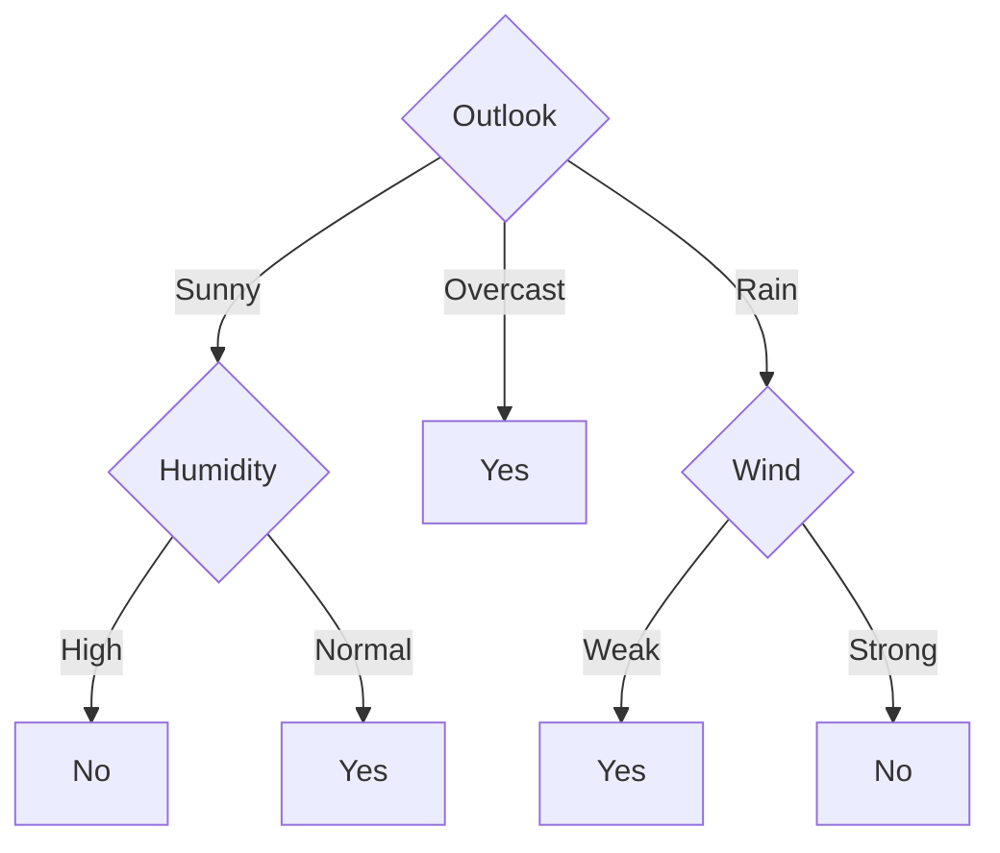
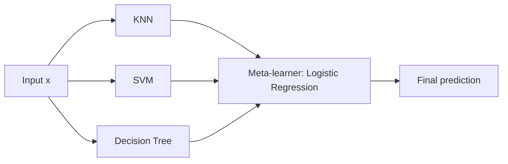

# Unit III — Non-parametric Classification & Ensemble Models

[⬅ Back to Index](README.md)

## Contents
1. [Parametric vs Non-parametric Models](#1-parametric-vs-non-parametric-models)
2. [K-Nearest Neighbours (KNN)](#2-k-nearest-neighbours-knn)
3. [Decision Trees](#3-decision-trees)
4. [Attribute Selection Measures](#4-attribute-selection-measures)
5. [ID3 Algorithm](#5-id3-algorithm)
6. [C4.5 Algorithm](#6-c45-algorithm)
7. [CART Algorithm](#7-cart-algorithm)
8. [Pruning Methods](#8-pruning-methods)
9. [Preventing Overfitting](#9-preventing-overfitting)
10. [Ensemble Models](#10-ensemble-models)
11. [Bagging](#11-bagging)
12. [Boosting](#12-boosting)
13. [Stacking](#13-stacking)
14. [Voting and Averaging](#14-voting-and-averaging)
15. [Formula Sheet](#15-formula-sheet)

---

## 1. Parametric vs Non-parametric Models

| Aspect | Parametric | Non-parametric |
|---|---|---|
| Number of parameters | Fixed, independent of data size | Grows with the amount of training data |
| Assumption about data | Strong (e.g., linear, Gaussian) | Few or none about the functional form |
| Examples | Linear/Logistic Regression, Naïve Bayes, Perceptron | KNN, Decision Trees, Kernel methods |
| Training speed | Fast | Can be slow (or no training for KNN) |
| Flexibility | Low — may underfit | High — may overfit |
| Data needed | Less | More |

---

## 2. K-Nearest Neighbours (KNN)

### 2.1 Idea

"Tell me who your neighbours are, and I'll tell you who you are." KNN stores the entire training set (**lazy learner / instance-based learning**) and classifies a new point by a **majority vote** of its $k$ closest training points.

### 2.2 Algorithm

1. Choose $k$ and a distance metric.
2. For a query point $\mathbf{x}_q$, compute the distance to every training point.
3. Select the $k$ nearest neighbours $N_k(\mathbf{x}_q)$.
4. **Classification:** majority vote

```math
\hat{y} = \arg\max_{c}\sum_{i\in N_k(\mathbf{x}_q)}\mathbb{1}(y_i = c)
```

5. **Regression:** average of neighbours' values

```math
\hat{y} = \frac{1}{k}\sum_{i\in N_k(\mathbf{x}_q)} y_i
```

### 2.3 Distance Metrics

**Euclidean ($L_2$):**

```math
d(\mathbf{x}, \mathbf{z}) = \sqrt{\sum_{j=1}^d (x_j - z_j)^2}
```

**Manhattan ($L_1$):**

```math
d(\mathbf{x}, \mathbf{z}) = \sum_{j=1}^d |x_j - z_j|
```

**Minkowski ($L_p$):** ($p=1$ Manhattan, $p=2$ Euclidean, $p\rightarrow\infty$ Chebyshev)

```math
d(\mathbf{x}, \mathbf{z}) = \left(\sum_{j=1}^d |x_j - z_j|^p\right)^{1/p}
```

**Chebyshev ($L_\infty$):**

```math
d(\mathbf{x}, \mathbf{z}) = \max_j |x_j - z_j|
```

**Hamming** (categorical): number of positions where the attributes differ.

### 2.4 Distance-Weighted KNN

Closer neighbours get more influence:

```math
w_i = \frac{1}{d(\mathbf{x}_q, \mathbf{x}_i)^2}, \qquad \hat{y} = \arg\max_c\sum_{i\in N_k}w_i\,\mathbb{1}(y_i = c)
```

For regression: $\hat{y} = \sum w_i y_i / \sum w_i$.

### 2.5 Choosing k

- **Small $k$** (e.g., 1): very flexible, noisy boundary → **high variance, overfitting**.
- **Large $k$**: smooth boundary → **high bias, underfitting**. If $k = m$, always predicts the majority class.
- Choose $k$ by **cross-validation**. Rule of thumb: $k \approx \sqrt{m}$. Use **odd** $k$ for binary classification to avoid ties.

### 2.6 Feature Scaling (Essential!)

Features with larger ranges dominate distances. Always scale:

```math
\text{Min-Max: } x' = \frac{x - x_{\min}}{x_{\max} - x_{\min}} \qquad \text{Z-score: } x' = \frac{x - \mu}{\sigma}
```

### 2.7 Properties

| Pros | Cons |
|---|---|
| No training phase; simple | Slow prediction: $O(md)$ per query |
| Naturally multi-class | Needs lots of memory (stores all data) |
| Non-linear boundaries | Sensitive to irrelevant features and scaling |
| Asymptotic guarantee: 1-NN error ≤ 2 × Bayes error (as $m\rightarrow\infty$) | Suffers from curse of dimensionality |

### 📝 Solved Numerical 2.1 — KNN Classification

| Point | $x_1$ | $x_2$ | Class |
|---|---|---|---|
| P1 | 1 | 2 | A |
| P2 | 2 | 3 | A |
| P3 | 3 | 1 | A |
| P4 | 5 | 5 | B |
| P5 | 7 | 7 | B |
| P6 | 8 | 6 | B |

Classify the query $\mathbf{q} = (4, 4)$ using $k = 1$, $k = 3$, and distance-weighted $k = 3$.

**Euclidean distances from (4, 4):**

| Point | Calculation | Distance | Rank | Class |
|---|---|---|---|---|
| P1 | $\sqrt{(4-1)^2 + (4-2)^2} = \sqrt{13}$ | 3.606 | 4 | A |
| P2 | $\sqrt{(4-2)^2 + (4-3)^2} = \sqrt{5}$ | 2.236 | 2 | A |
| P3 | $\sqrt{(4-3)^2 + (4-1)^2} = \sqrt{10}$ | 3.162 | 3 | A |
| P4 | $\sqrt{(4-5)^2 + (4-5)^2} = \sqrt{2}$ | 1.414 | 1 | B |
| P5 | $\sqrt{(4-7)^2 + (4-7)^2} = \sqrt{18}$ | 4.243 | 5 | B |
| P6 | $\sqrt{(4-8)^2 + (4-6)^2} = \sqrt{20}$ | 4.472 | 6 | B |

- **$k = 1$:** nearest is P4 → **Class B**.
- **$k = 3$:** P4 (B), P2 (A), P3 (A) → A = 2, B = 1 → **Class A**.
- **Weighted $k = 3$** ($w = 1/d^2$):

```math
W_B = \frac{1}{2} = 0.5, \qquad W_A = \frac{1}{5} + \frac{1}{10} = 0.3
```

  $W_B > W_A$ → **Class B**.

This shows how the choice of $k$ and weighting can change the answer.

### 📝 Solved Numerical 2.2 — KNN Regression

House sizes (sq ft ×100) and prices (lakhs): (8, 40), (10, 50), (12, 55), (15, 70), (20, 90). Predict price for size 11 with $k = 3$.

Distances: $|11-8| = 3$, $|11-10| = 1$, $|11-12| = 1$, $|11-15| = 4$, $|11-20| = 9$. Nearest 3: sizes 10, 12, 8.

```math
\hat{y} = \frac{50 + 55 + 40}{3} = 48.33 \text{ lakhs}
```

---

## 3. Decision Trees

### 3.1 Structure

A decision tree is a flowchart-like structure:
- **Root node:** the first test (best attribute).
- **Internal (decision) nodes:** test an attribute.
- **Branches:** outcomes of the test.
- **Leaf nodes:** class label (classification) or value (regression).

A path from root to leaf = an **IF–THEN rule**. The tree partitions the feature space into **axis-parallel rectangles**.

### 3.2 General Greedy Algorithm (Hunt's Algorithm / Top-Down Induction)

```
BuildTree(S, Attributes):
  if all examples in S have the same class c:  return Leaf(c)
  if Attributes is empty:                      return Leaf(majority class of S)
  A* = attribute with best split score (Info Gain / Gain Ratio / Gini)
  create node testing A*
  for each value v of A*:
      S_v = examples in S with A* = v
      if S_v is empty: attach Leaf(majority class of S)
      else: attach BuildTree(S_v, Attributes - {A*})
  return node
```

---

## 4. Attribute Selection Measures

### 4.1 Entropy

Entropy measures **impurity / uncertainty** of a set $S$ with $c$ classes:

```math
H(S) = -\sum_{i=1}^{c} p_i\log_2 p_i
```

where $p_i$ = proportion of class $i$ in $S$ (with $0\log_2 0 = 0$).

For 2 classes: $H = -p\log_2 p - (1-p)\log_2(1-p)$.
- Pure set ($p = 0$ or 1): $H = 0$.
- Equal split ($p = 0.5$): $H = 1$ (maximum for 2 classes). For $c$ classes, max $= \log_2 c$.

### 4.2 Information Gain (used by ID3)

Expected reduction in entropy after splitting on attribute $A$:

```math
\text{Gain}(S, A) = H(S) - \sum_{v\in\text{Values}(A)}\frac{|S_v|}{|S|}H(S_v)
```

**Problem:** Information Gain is biased toward attributes with **many values** (e.g., "Day ID" would give perfect splits with Gain = H(S) but is useless).

### 4.3 Split Information and Gain Ratio (used by C4.5)

```math
\text{SplitInfo}(S, A) = -\sum_{v\in\text{Values}(A)}\frac{|S_v|}{|S|}\log_2\frac{|S_v|}{|S|}
```

```math
\text{GainRatio}(S, A) = \frac{\text{Gain}(S, A)}{\text{SplitInfo}(S, A)}
```

SplitInfo is large for attributes that split data into many small partitions, penalising them.

### 4.4 Gini Index (used by CART)

```math
\text{Gini}(S) = 1 - \sum_{i=1}^{c}p_i^2
```

```math
\text{Gini}_A(S) = \sum_{v}\frac{|S_v|}{|S|}\text{Gini}(S_v), \qquad \Delta\text{Gini}(A) = \text{Gini}(S) - \text{Gini}_A(S)
```

Pick the split with the **lowest weighted Gini** (= largest Gini gain). For 2 classes max Gini = 0.5.

### 4.5 Misclassification Error

```math
\text{Error}(S) = 1 - \max_i p_i
```

### 4.6 Comparison (binary, class proportion $p$)

| $p$ | Entropy | Gini | Misclass. Error |
|---|---|---|---|
| 0.0 | 0 | 0 | 0 |
| 0.1 | 0.469 | 0.18 | 0.1 |
| 0.3 | 0.881 | 0.42 | 0.3 |
| 0.5 | 1.000 | 0.50 | 0.5 |

---

## 5. ID3 Algorithm

**ID3 (Iterative Dichotomiser 3)** — Ross Quinlan, 1986.
- Uses **Information Gain**.
- Handles **categorical** attributes only.
- Multi-way splits (one branch per value).
- No pruning, no missing-value handling.

### 📝 Solved Numerical 5.1 — Full ID3 on Play Tennis Dataset

(Use the 14-day Play Tennis table from Unit II — 9 Yes, 5 No.)

**Step 1 — Entropy of the whole set:**

```math
H(S) = -\frac{9}{14}\log_2\frac{9}{14} - \frac{5}{14}\log_2\frac{5}{14} = 0.643(0.637) + 0.357(1.485) = 0.410 + 0.530 = 0.940
```

**Step 2 — Gain for each attribute.**

**Outlook:**

| Value | Yes | No | Total | Entropy |
|---|---|---|---|---|
| Sunny | 2 | 3 | 5 | $-\frac{2}{5}\log_2\frac{2}{5} - \frac{3}{5}\log_2\frac{3}{5} = 0.971$ |
| Overcast | 4 | 0 | 4 | 0 |
| Rain | 3 | 2 | 5 | 0.971 |

```math
\text{Gain}(S, \text{Outlook}) = 0.940 - \left[\frac{5}{14}(0.971) + \frac{4}{14}(0) + \frac{5}{14}(0.971)\right] = 0.940 - 0.694 = 0.246
```

**Temperature:**

| Value | Yes | No | Total | Entropy |
|---|---|---|---|---|
| Hot | 2 | 2 | 4 | 1.000 |
| Mild | 4 | 2 | 6 | 0.918 |
| Cool | 3 | 1 | 4 | 0.811 |

```math
\text{Gain}(S, \text{Temp}) = 0.940 - \left[\frac{4}{14}(1) + \frac{6}{14}(0.918) + \frac{4}{14}(0.811)\right] = 0.940 - 0.911 = 0.029
```

**Humidity:**

| Value | Yes | No | Total | Entropy |
|---|---|---|---|---|
| High | 3 | 4 | 7 | 0.985 |
| Normal | 6 | 1 | 7 | 0.592 |

```math
\text{Gain}(S, \text{Humidity}) = 0.940 - \left[\frac{7}{14}(0.985) + \frac{7}{14}(0.592)\right] = 0.940 - 0.789 = 0.151
```

**Wind:**

| Value | Yes | No | Total | Entropy |
|---|---|---|---|---|
| Weak | 6 | 2 | 8 | 0.811 |
| Strong | 3 | 3 | 6 | 1.000 |

```math
\text{Gain}(S, \text{Wind}) = 0.940 - \left[\frac{8}{14}(0.811) + \frac{6}{14}(1)\right] = 0.940 - 0.892 = 0.048
```

**Summary:**

| Attribute | Gain |
|---|---|
| **Outlook** | **0.246** ← highest → ROOT |
| Humidity | 0.151 |
| Wind | 0.048 |
| Temperature | 0.029 |

**Step 3 — Overcast branch** is pure (4 Yes) → Leaf **Yes**.

**Step 4 — Sunny branch** ($S_{\text{sunny}}$: D1 No, D2 No, D8 No, D9 Yes, D11 Yes; $H = 0.971$)

| Attribute | Split | Gain |
|---|---|---|
| Humidity | High {N,N,N} = 0; Normal {Y,Y} = 0 | $0.971 - 0 = $ **0.971** |
| Temperature | Hot {N,N} = 0; Mild {N,Y} = 1; Cool {Y} = 0 | $0.971 - \frac{2}{5}(1) = 0.571$ |
| Wind | Weak {N,N,Y} = 0.918; Strong {N,Y} = 1 | $0.971 - \frac{3}{5}(0.918) - \frac{2}{5}(1) = 0.020$ |

→ Split Sunny on **Humidity**.

**Step 5 — Rain branch** ($S_{\text{rain}}$: D4 Yes, D5 Yes, D6 No, D10 Yes, D14 No; $H = 0.971$)

| Attribute | Gain |
|---|---|
| Wind | Weak {Y,Y,Y} = 0; Strong {N,N} = 0 → **0.971** |
| Humidity | 0.020 |
| Temperature | 0.020 |

→ Split Rain on **Wind**.

**Final Tree:**



**Rules:**
- IF Outlook = Overcast THEN Yes
- IF Outlook = Sunny AND Humidity = High THEN No
- IF Outlook = Sunny AND Humidity = Normal THEN Yes
- IF Outlook = Rain AND Wind = Weak THEN Yes
- IF Outlook = Rain AND Wind = Strong THEN No

---

## 6. C4.5 Algorithm

**C4.5** — Quinlan, 1993 (successor of ID3). Improvements:

1. Uses **Gain Ratio** instead of Information Gain (removes bias toward many-valued attributes).
2. Handles **continuous attributes** by finding the best threshold.
3. Handles **missing values** (fractional instances distributed according to known-value proportions).
4. Performs **post-pruning** (error-based / pessimistic pruning).
5. Converts trees to rules.

### 6.1 Handling Continuous Attributes

1. Sort the values of the attribute.
2. Candidate thresholds = midpoints between adjacent values **where the class label changes**.
3. For each threshold $t$, split into $A \leq t$ and $A > t$; compute gain.
4. Choose the threshold with the maximum gain (gain ratio).

### 📝 Solved Numerical 6.1 — Gain Ratio for Outlook

From ID3: $\text{Gain}(\text{Outlook}) = 0.246$. Partition sizes 5, 4, 5.

```math
\text{SplitInfo} = -\frac{5}{14}\log_2\frac{5}{14} - \frac{4}{14}\log_2\frac{4}{14} - \frac{5}{14}\log_2\frac{5}{14} = 0.530 + 0.516 + 0.530 = 1.577
```

```math
\text{GainRatio}(\text{Outlook}) = \frac{0.246}{1.577} = 0.156
```

All gain ratios:

| Attribute | Gain | SplitInfo | Gain Ratio |
|---|---|---|---|
| Outlook | 0.246 | 1.577 | **0.156** |
| Humidity | 0.151 | 1.000 | 0.151 |
| Wind | 0.048 | 0.985 | 0.049 |
| Temperature | 0.029 | 1.557 | 0.019 |

Outlook still wins, but notice Humidity is now much closer (because Outlook has 3 values).

### 📝 Solved Numerical 6.2 — Continuous Attribute Threshold

| Temperature | 40 | 48 | 60 | 72 | 80 | 90 |
|---|---|---|---|---|---|---|
| Play | No | No | Yes | Yes | Yes | No |

$H(S) = 1$ (3 Yes, 3 No). Label changes between 48→60 and 80→90. Candidate thresholds: $t_1 = 54$, $t_2 = 85$.

**$t = 54$:** Left {N, N} → $H = 0$; Right {Y, Y, Y, N} → $H = 0.811$

```math
\text{Gain} = 1 - \frac{2}{6}(0) - \frac{4}{6}(0.811) = 1 - 0.541 = 0.459
```

**$t = 85$:** Left {N, N, Y, Y, Y} → $H = 0.971$; Right {N} → $H = 0$

```math
\text{Gain} = 1 - \frac{5}{6}(0.971) = 1 - 0.809 = 0.191
```

**Best split:** Temperature ≤ 54.

---

## 7. CART Algorithm

**CART (Classification And Regression Trees)** — Breiman et al., 1984.
- Always makes **binary** splits.
- Uses **Gini index** for classification.
- Uses **variance reduction / MSE (SSE)** for regression.
- Uses **cost-complexity pruning**.

### 7.1 Regression Trees

At each node, choose the split minimising the total **sum of squared errors**:

```math
\text{SSE} = \sum_{i\in L}(y_i - \bar{y}_L)^2 + \sum_{i\in R}(y_i - \bar{y}_R)^2
```

Leaf prediction = mean of target values in the leaf.

### 📝 Solved Numerical 7.1 — Gini for Outlook (CART style)

$\text{Gini}(S) = 1 - (9/14)^2 - (5/14)^2 = 1 - 0.413 - 0.128 = 0.459$

```math
\text{Gini(Sunny)} = 1 - \left(\frac{2}{5}\right)^2 - \left(\frac{3}{5}\right)^2 = 1 - 0.16 - 0.36 = 0.48
```

```math
\text{Gini(Overcast)} = 1 - 1^2 = 0, \qquad \text{Gini(Rain)} = 0.48
```

```math
\text{Gini}_{\text{Outlook}} = \frac{5}{14}(0.48) + \frac{4}{14}(0) + \frac{5}{14}(0.48) = 0.343, \qquad \Delta\text{Gini} = 0.459 - 0.343 = 0.116
```

Other attributes: Humidity 0.367 (gain 0.092), Wind 0.429 (gain 0.031), Temperature 0.440 (gain 0.019). → **Outlook** gives lowest weighted Gini.

> Strictly, CART uses binary splits; for Outlook it would test groupings like {Overcast} vs {Sunny, Rain}. With {Overcast} vs {Sunny, Rain}: Gini of {Sunny, Rain} (5 Yes, 5 No) = 0.5, weighted $= \frac{10}{14}(0.5) = 0.357$.

### 📝 Solved Numerical 7.2 — Regression Tree Split

| $x$ | 1 | 2 | 3 | 4 | 5 | 6 |
|---|---|---|---|---|---|---|
| $y$ | 5 | 6 | 7 | 15 | 16 | 17 |

Before split: $\bar{y} = 11$, SSE $= 36+25+16+16+25+36 = 154$.

Split at $x \leq 3.5$: Left {5, 6, 7} mean 6, SSE $= 1+0+1 = 2$; Right {15, 16, 17} mean 16, SSE $= 2$. Total SSE $= 4$.

Reduction $= 154 - 4 = 150$ — an excellent split. Prediction for $x = 2.5$ is 6, for $x = 5.5$ is 16.

### 7.2 ID3 vs C4.5 vs CART

| Feature | ID3 | C4.5 | CART |
|---|---|---|---|
| Splitting criterion | Information Gain | Gain Ratio | Gini (cls.), SSE (reg.) |
| Split type | Multi-way | Multi-way | Binary only |
| Continuous attributes | No | Yes | Yes |
| Missing values | No | Yes | Yes (surrogate splits) |
| Pruning | No | Error-based (pessimistic) | Cost-complexity |
| Regression | No | No | Yes |

---

## 8. Pruning Methods

Fully grown trees **overfit** (they fit noise). **Pruning** removes branches that add little predictive power.

### 8.1 Pre-pruning (Early Stopping)

Stop growing the tree before it perfectly fits the data when:
- Maximum depth is reached.
- Number of samples in a node < minimum threshold (`min_samples_split`).
- Information gain / impurity decrease < threshold.
- A statistical test (e.g., $\chi^2$) shows the split is not significant.

**Pro:** fast. **Con:** "horizon effect" — may stop too early (a weak split now could enable strong splits later).

### 8.2 Post-pruning

Grow the full tree, then prune bottom-up. Generally more effective.

**(a) Reduced Error Pruning (REP):**
1. Split data into training and **validation** sets.
2. For each internal node, tentatively replace its subtree with a leaf (majority class).
3. If validation accuracy does not decrease, prune permanently.
4. Repeat until further pruning hurts.

**(b) Pessimistic Error Pruning (C4.5):** uses training data with a pessimistic (upper confidence bound) estimate of error. With continuity correction, the error of a subtree with $L$ leaves and $e$ training errors on $N$ samples is estimated as:

```math
e'(T) = \frac{e(T) + L/2}{N}
```

Prune if the corrected error of the leaf is not worse than that of the subtree (within one standard error).

**(c) Cost-Complexity Pruning (CART / Weakest-Link Pruning):**

```math
R_\alpha(T) = R(T) + \alpha\,|\tilde{T}|
```

- $R(T)$ = misclassification rate (or SSE) of tree $T$
- $|\tilde{T}|$ = number of leaves
- $\alpha \geq 0$ = complexity parameter (penalty per leaf)

For each internal node $t$ with subtree $T_t$, the **effective alpha** at which pruning becomes worthwhile:

```math
\alpha_{\text{eff}}(t) = \frac{R(t) - R(T_t)}{|\tilde{T}_t| - 1}
```

Repeatedly prune the node with the **smallest** $\alpha_{\text{eff}}$ (the weakest link). This produces a sequence of trees; choose the best one using cross-validation.

### 📝 Solved Numerical 8.1 — Cost-Complexity Pruning

A tree has two internal candidate nodes ($R$ values are error rates measured on the whole training set):

| Node | $R(t)$ if collapsed to a leaf | $R(T_t)$ of its subtree | Leaves in subtree $\lvert\tilde{T}_t\rvert$ |
|---|---|---|---|
| $t_1$ | 0.25 | 0.10 | 4 |
| $t_2$ | 0.13 | 0.10 | 2 |

```math
\alpha_{\text{eff}}(t_1) = \frac{0.25 - 0.10}{4 - 1} = \frac{0.15}{3} = 0.05
```

```math
\alpha_{\text{eff}}(t_2) = \frac{0.13 - 0.10}{2 - 1} = \frac{0.03}{1} = 0.03
```

$\alpha_{\text{eff}}(t_2) < \alpha_{\text{eff}}(t_1)$ → **$t_2$ is the weakest link and is pruned first** (at $\alpha = 0.03$). $t_1$ is pruned only once $\alpha$ reaches 0.05.

**Verification at $\alpha = 0.04$ for node $t_2$:**

```math
R_\alpha(\text{subtree}) = 0.10 + 0.04 \times 2 = 0.18, \qquad R_\alpha(\text{leaf}) = 0.13 + 0.04 \times 1 = 0.17
```

The leaf has the lower cost → pruning $t_2$ is correct. ✅

**At $\alpha = 0.04$ for node $t_1$:** subtree $= 0.10 + 0.16 = 0.26$, leaf $= 0.25 + 0.04 = 0.29$ → keep the subtree.

---

## 9. Preventing Overfitting

**Overfitting** in trees: the tree is too deep, leaves contain very few samples, training accuracy ≈ 100% but test accuracy is poor.

| Technique | How it helps |
|---|---|
| Pre-pruning | Limit `max_depth`, `min_samples_split`, `min_samples_leaf`, `max_leaf_nodes` |
| Post-pruning | REP, pessimistic, cost-complexity |
| Cross-validation | Choose hyperparameters ($k$ in KNN, depth / $\alpha$ in trees) on held-out data |
| More training data | Reduces variance |
| Feature selection | Remove noisy/irrelevant features |
| Ensembles | Random Forests average many trees → reduced variance |
| Minimum description length (MDL) | Prefer the tree that minimises (tree size + encoded errors) |
| For KNN: larger $k$ | Smoother boundary |

**Detecting overfitting:** large gap between training accuracy and validation accuracy; validation error starts increasing while training error keeps decreasing as tree depth grows.

---

## 10. Ensemble Models

### 10.1 Idea and Importance

An **ensemble** combines predictions of multiple base models ("weak learners") to produce a stronger model. "Wisdom of the crowd."

**Why ensembles work:**
1. **Statistical:** many hypotheses fit training data equally well; averaging reduces the risk of choosing a bad one.
2. **Computational:** individual learners may get stuck in local optima; combining starting points helps.
3. **Representational:** the true function may not be in any single model's hypothesis class, but a combination can approximate it.

**Requirements:** base learners must be (a) **better than random** and (b) **diverse** (make different errors).

### 10.2 Mathematical Justification — Majority Vote

$n$ independent classifiers, each with accuracy $p > 0.5$. Majority vote is correct if more than half are correct:

```math
P(\text{ensemble correct}) = \sum_{k=\lfloor n/2\rfloor+1}^{n}\binom{n}{k}p^k(1-p)^{n-k}
```

### 📝 Solved Numerical 10.1 — Majority Vote Accuracy

**3 classifiers, $p = 0.7$:**

```math
P = \binom{3}{2}(0.7)^2(0.3) + \binom{3}{3}(0.7)^3 = 3(0.49)(0.3) + 0.343 = 0.441 + 0.343 = 0.784
```

**5 classifiers, $p = 0.7$:**

```math
P = \binom{5}{3}(0.7)^3(0.3)^2 + \binom{5}{4}(0.7)^4(0.3) + (0.7)^5 = 0.3087 + 0.3602 + 0.1681 = 0.837
```

Accuracy rises from 70% → 78.4% → 83.7%. (Real classifiers are correlated, so gains are smaller.)

### 10.3 Variance Reduction by Averaging

For $B$ models each with variance $\sigma^2$ and pairwise correlation $\rho$:

```math
\text{Var}\left(\frac{1}{B}\sum_{b=1}^{B}f_b\right) = \rho\sigma^2 + \frac{1-\rho}{B}\sigma^2
```

- If $\rho = 0$ (independent): variance $= \sigma^2/B$.
- As $B\rightarrow\infty$: variance $\rightarrow\rho\sigma^2$. So **reducing correlation** is key (idea behind Random Forests).

### 📝 Solved Numerical 10.2

$\sigma^2 = 1$, $\rho = 0.3$, $B = 50$:

```math
\text{Var} = 0.3(1) + \frac{0.7}{50}(1) = 0.3 + 0.014 = 0.314
```

A 68.6% reduction compared to a single model.

### 10.4 Types of Ensembles

| Method | Base learners | Training | Combination | Reduces |
|---|---|---|---|---|
| Bagging | Same type, parallel | Bootstrap samples | Vote / average | Variance |
| Boosting | Same type, sequential | Reweighted data / residuals | Weighted vote / sum | Bias (and variance) |
| Stacking | Different types | Full data + meta-learner | Learned combiner | Both |
| Voting / Averaging | Different types | Independently | Vote / average | Variance |

---

## 11. Bagging

**Bagging = Bootstrap AGGregatING** (Breiman, 1996).

### 11.1 Algorithm

1. For $b = 1$ to $B$:
   - Draw a **bootstrap sample** $S_b$ of size $m$ from $S$ **with replacement**.
   - Train model $f_b$ on $S_b$.
2. Combine:

```math
\text{Classification: } \hat{y} = \text{mode}\lbrace f_1(\mathbf{x}), \dots, f_B(\mathbf{x})\rbrace \qquad \text{Regression: } \hat{y} = \frac{1}{B}\sum_{b=1}^B f_b(\mathbf{x})
```

Works best with **high-variance, low-bias** learners (deep decision trees).

### 11.2 Bootstrap Probability

Probability a particular example is **not** chosen in a bootstrap sample of size $m$:

```math
\left(1 - \frac{1}{m}\right)^m \xrightarrow{m\rightarrow\infty} e^{-1} \approx 0.368
```

So each bootstrap sample contains about **63.2%** unique examples; the remaining ~36.8% are **Out-of-Bag (OOB)** and can be used as a free validation set.

**OOB error:** for each example, predict using only the models that did not see it in training; average the errors.

### 📝 Solved Numerical 11.1

For $m = 10$: $P(\text{not chosen}) = (0.9)^{10} = 0.3487$. Expected OOB examples per bootstrap $= 10 \times 0.3487 \approx 3.5$.

### 11.3 Random Forest

Bagging of decision trees **plus** random feature selection: at each split, only a random subset of $m_{try}$ features is considered.

- Classification: $m_{try} \approx \sqrt{d}$; Regression: $m_{try} \approx d/3$.
- This **decorrelates** trees (reduces $\rho$), further reducing variance.
- Provides **feature importance** (mean decrease in impurity or permutation importance).

---

## 12. Boosting

Train learners **sequentially**; each new learner focuses on the mistakes of the previous ones. Converts **weak learners** (slightly better than random) into a **strong learner**.

### 12.1 AdaBoost (Adaptive Boosting) — Freund & Schapire, 1997

Labels $y_i \in \lbrace -1, +1 \rbrace$.

1. **Initialise weights:** $w_i^{(1)} = \frac{1}{m}$ for $i = 1, \dots, m$.
2. **For $t = 1$ to $T$:**
   - Train weak learner $h_t$ using weights $w^{(t)}$.
   - **Weighted error:**

```math
\epsilon_t = \sum_{i=1}^m w_i^{(t)}\,\mathbb{1}[h_t(\mathbf{x}_i)\neq y_i]
```

   - **Learner weight (say):**

```math
\alpha_t = \frac{1}{2}\ln\left(\frac{1-\epsilon_t}{\epsilon_t}\right)
```

   - **Update sample weights:**

```math
w_i^{(t+1)} = \frac{w_i^{(t)}\exp\left(-\alpha_t\,y_i\,h_t(\mathbf{x}_i)\right)}{Z_t}
```

   (Correct: multiply by $e^{-\alpha_t}$; wrong: multiply by $e^{\alpha_t}$.) $Z_t$ is the normalisation factor so weights sum to 1:

```math
Z_t = \sum_{i=1}^m w_i^{(t)}\exp(-\alpha_t y_i h_t(\mathbf{x}_i)) = 2\sqrt{\epsilon_t(1-\epsilon_t)}
```

3. **Final classifier:**

```math
H(\mathbf{x}) = \text{sign}\left(\sum_{t=1}^T\alpha_t h_t(\mathbf{x})\right)
```

**Training error bound:**

```math
\text{Training error} \leq \prod_{t=1}^T Z_t = \prod_{t=1}^T 2\sqrt{\epsilon_t(1-\epsilon_t)} \leq \exp\left(-2\sum_{t=1}^T\gamma_t^2\right), \quad \gamma_t = \frac{1}{2}-\epsilon_t
```

→ training error decreases **exponentially** as long as each learner is better than random.

### 📝 Solved Numerical 12.1 — One Round of AdaBoost

10 training samples, equal weights $w_i = 0.1$. The first stump misclassifies samples 3, 7, 9.

**Step 1 — error:**

```math
\epsilon_1 = 0.1 + 0.1 + 0.1 = 0.3
```

**Step 2 — learner weight:**

```math
\alpha_1 = \frac{1}{2}\ln\frac{1-0.3}{0.3} = \frac{1}{2}\ln(2.333) = \frac{1}{2}(0.8473) = 0.4236
```

**Step 3 — unnormalised weights:**

```math
\text{Wrong: } 0.1 \times e^{0.4236} = 0.1 \times 1.5275 = 0.15275
```

```math
\text{Correct: } 0.1 \times e^{-0.4236} = 0.1 \times 0.6547 = 0.06547
```

**Step 4 — normalise:**

```math
Z_1 = 3(0.15275) + 7(0.06547) = 0.45826 + 0.45826 = 0.9165 \quad \left(= 2\sqrt{0.3 \times 0.7} \ ✓\right)
```

```math
w_{\text{wrong}} = \frac{0.15275}{0.9165} = 0.1667, \qquad w_{\text{correct}} = \frac{0.06547}{0.9165} = 0.0714
```

**Check:** $3(0.1667) + 7(0.0714) = 0.5 + 0.5 = 1$ ✓. After reweighting, the misclassified samples carry **exactly half** the total weight — the next learner is forced to focus on them.

### 12.2 Gradient Boosting

Builds an additive model by fitting each new learner to the **negative gradient** (pseudo-residuals) of the loss:

1. Initialise: $F_0(\mathbf{x}) = \arg\min_c\sum_i L(y_i, c)$ (for squared loss, $F_0 = \bar{y}$).
2. For $t = 1$ to $T$:

```math
r_{i}^{(t)} = -\left[\frac{\partial L(y_i, F(\mathbf{x}_i))}{\partial F(\mathbf{x}_i)}\right]_{F = F_{t-1}}
```

   - Fit a regression tree $h_t$ to $\lbrace(\mathbf{x}_i, r_i^{(t)})\rbrace$.
   - Update with learning rate (shrinkage) $\nu$:

```math
F_t(\mathbf{x}) = F_{t-1}(\mathbf{x}) + \nu\,h_t(\mathbf{x})
```

For squared loss $L = \frac{1}{2}(y - F)^2$, the pseudo-residual is simply $r_i = y_i - F(\mathbf{x}_i)$.

**Popular implementations:** XGBoost, LightGBM, CatBoost.

### 📝 Solved Numerical 12.2 — Gradient Boosting (2 steps)

Data: $x = (1, 2, 3)$, $y = (3, 5, 7)$, $\nu = 0.5$.

**Step 0:** $F_0 = \bar{y} = 5$. Residuals: $r = (3-5, 5-5, 7-5) = (-2, 0, 2)$. MSE $= (4 + 0 + 4)/3 = 2.667$.

**Step 1:** Fit a stump to residuals: split at $x \leq 1.5$ → left mean $= -2$, right mean $= (0+2)/2 = 1$.

```math
F_1 = F_0 + 0.5\,h_1 = (5 + 0.5(-2),\ 5 + 0.5(1),\ 5 + 0.5(1)) = (4,\ 5.5,\ 5.5)
```

New residuals: $(3-4, 5-5.5, 7-5.5) = (-1, -0.5, 1.5)$. MSE $= (1 + 0.25 + 2.25)/3 = 1.167$.

Error dropped from 2.667 to 1.167 in one round. Further rounds keep fitting residuals.

### 12.3 Bagging vs Boosting

| Aspect | Bagging | Boosting |
|---|---|---|
| Training | Parallel, independent | Sequential, dependent |
| Sampling | Bootstrap (uniform) | Weighted (focus on errors) |
| Model weight | Equal | Weighted by accuracy ($\alpha_t$) |
| Main effect | Reduces **variance** | Reduces **bias** |
| Base learner | Strong, unstable (deep trees) | Weak (stumps, shallow trees) |
| Overfitting | Resistant | Can overfit noisy data / outliers |
| Example | Random Forest | AdaBoost, XGBoost |

---

## 13. Stacking

**Stacked Generalization** (Wolpert, 1992) — uses a **meta-learner** to learn how to best combine base learners.

### 13.1 Algorithm

1. **Level-0 (base) models:** train diverse models $f_1, \dots, f_M$ (e.g., KNN, SVM, Decision Tree).
2. Generate **out-of-fold predictions** using $K$-fold CV: for each fold, train on $K-1$ folds and predict the held-out fold. This gives a new feature vector for each training example:

```math
\mathbf{z}_i = \left(f_1(\mathbf{x}_i), f_2(\mathbf{x}_i), \dots, f_M(\mathbf{x}_i)\right)
```

3. **Level-1 (meta) model** $g$ (often logistic/linear regression) is trained on $\lbrace(\mathbf{z}_i, y_i)\rbrace$.
4. **Prediction:**

```math
\hat{y} = g\left(f_1(\mathbf{x}), f_2(\mathbf{x}), \dots, f_M(\mathbf{x})\right)
```

**Why out-of-fold?** If base models predict on data they were trained on, their predictions look overly accurate and the meta-learner overfits (data leakage).



### 📝 Solved Numerical 13.1

A linear meta-learner learned weights $g(\mathbf{z}) = 0.2 z_1 + 0.5 z_2 + 0.3 z_3$. Base models predict probabilities $(0.6, 0.8, 0.3)$ for class 1.

```math
\hat{p} = 0.2(0.6) + 0.5(0.8) + 0.3(0.3) = 0.12 + 0.40 + 0.09 = 0.61 \Rightarrow \text{Class 1}
```

**Blending** is a simpler variant: use a single hold-out set (instead of K-fold) to create meta-features.

---

## 14. Voting and Averaging

### 14.1 Hard (Majority) Voting — classification

```math
\hat{y} = \text{mode}\lbrace h_1(\mathbf{x}), h_2(\mathbf{x}), \dots, h_M(\mathbf{x})\rbrace
```

### 14.2 Soft Voting — average predicted probabilities

```math
\hat{y} = \arg\max_c\frac{1}{M}\sum_{j=1}^M P_j(c\mid\mathbf{x})
```

### 14.3 Weighted Voting

```math
\hat{y} = \arg\max_c\sum_{j=1}^M w_j\,\mathbb{1}[h_j(\mathbf{x}) = c], \qquad \sum_j w_j = 1
```

### 14.4 Simple and Weighted Averaging — regression

```math
\hat{y} = \frac{1}{M}\sum_{j=1}^M f_j(\mathbf{x}) \qquad\qquad \hat{y} = \sum_{j=1}^M w_j f_j(\mathbf{x})
```

### 📝 Solved Numerical 14.1 — Hard vs Soft Voting

Three models give $P(\text{class 1})$: M1 = 0.90, M2 = 0.45, M3 = 0.40.

**Hard voting:** M1 → 1, M2 → 0, M3 → 0. Votes: class 0 = 2, class 1 = 1 → **Class 0**.

**Soft voting:**

```math
\bar{P}(1) = \frac{0.90 + 0.45 + 0.40}{3} = 0.583, \qquad \bar{P}(0) = 0.417 \Rightarrow \textbf{Class 1}
```

The answers differ! Soft voting accounts for M1's high confidence, while M2 and M3 are barely below 0.5. Soft voting is usually better when probabilities are well-calibrated.

### 📝 Solved Numerical 14.2 — Weighted Averaging (Regression)

Three models predict house price: 10, 12, 14 lakhs; weights 0.2, 0.3, 0.5.

```math
\hat{y} = 0.2(10) + 0.3(12) + 0.5(14) = 2 + 3.6 + 7 = 12.6 \text{ lakhs}
```

Simple average $= 12$ lakhs.

---

## 15. Formula Sheet

| Concept | Formula |
|---|---|
| Euclidean distance | $\sqrt{\sum_j(x_j - z_j)^2}$ |
| Manhattan distance | $\sum_j\lvert x_j - z_j\rvert$ |
| Minkowski distance | $\left(\sum_j\lvert x_j-z_j\rvert^p\right)^{1/p}$ |
| Weighted KNN | $w_i = 1/d_i^2$ |
| Min-max scaling | $(x - x_{\min})/(x_{\max} - x_{\min})$ |
| Entropy | $H(S) = -\sum_i p_i\log_2 p_i$ |
| Information gain | $H(S) - \sum_v\frac{\lvert S_v\rvert}{\lvert S\rvert}H(S_v)$ |
| Split information | $-\sum_v\frac{\lvert S_v\rvert}{\lvert S\rvert}\log_2\frac{\lvert S_v\rvert}{\lvert S\rvert}$ |
| Gain ratio | Gain / SplitInfo |
| Gini index | $1 - \sum_i p_i^2$ |
| Misclassification error | $1 - \max_i p_i$ |
| Regression tree SSE | $\sum_L(y-\bar{y}_L)^2 + \sum_R(y-\bar{y}_R)^2$ |
| Cost complexity | $R_\alpha(T) = R(T) + \alpha\lvert\tilde{T}\rvert$ |
| Effective alpha | $\frac{R(t) - R(T_t)}{\lvert\tilde{T}_t\rvert - 1}$ |
| Pessimistic error | $(e + L/2)/N$ |
| Majority vote accuracy | $\sum_{k>n/2}\binom{n}{k}p^k(1-p)^{n-k}$ |
| Ensemble variance | $\rho\sigma^2 + \frac{1-\rho}{B}\sigma^2$ |
| Bootstrap OOB fraction | $(1-1/m)^m \approx 0.368$ |
| AdaBoost error | $\epsilon_t = \sum_i w_i\mathbb{1}[h_t(\mathbf{x}_i)\neq y_i]$ |
| AdaBoost alpha | $\alpha_t = \frac{1}{2}\ln\frac{1-\epsilon_t}{\epsilon_t}$ |
| AdaBoost weight update | $w_i \leftarrow w_i e^{-\alpha_t y_i h_t(\mathbf{x}_i)}/Z_t$ |
| AdaBoost normaliser | $Z_t = 2\sqrt{\epsilon_t(1-\epsilon_t)}$ |
| AdaBoost final | $H(\mathbf{x}) = \text{sign}\left(\sum_t\alpha_t h_t(\mathbf{x})\right)$ |
| Gradient boosting | $F_t = F_{t-1} + \nu h_t$, $h_t$ fit to $-\partial L/\partial F$ |
| Soft voting | $\arg\max_c\frac{1}{M}\sum_j P_j(c\mid\mathbf{x})$ |
| Weighted averaging | $\sum_j w_j f_j(\mathbf{x})$ |

---

[⬅ Unit II](Unit-2-Classification.md) | [Back to Index](README.md) | [Next: Unit IV ➡](Unit-4-Regression-and-Clustering.md)
