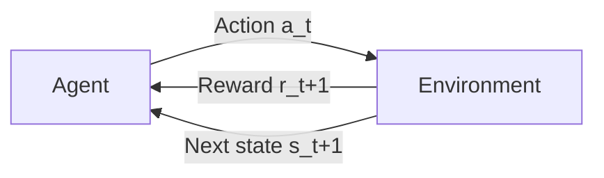

# Unit V — Reinforcement Learning

[⬅ Back to Index](README.md)

## Contents
1. [Fundamentals of Reinforcement Learning](#1-fundamentals-of-reinforcement-learning)
2. [Components of RL](#2-components-of-rl)
3. [Exploration vs Exploitation](#3-exploration-vs-exploitation)
4. [Markov Decision Processes (MDPs)](#4-markov-decision-processes-mdps)
5. [Returns and Discounting](#5-returns-and-discounting)
6. [Policies and Value Functions](#6-policies-and-value-functions)
7. [Bellman Equations](#7-bellman-equations)
8. [Solving MDPs: Dynamic Programming](#8-solving-mdps-dynamic-programming)
9. [Monte Carlo Methods (brief)](#9-monte-carlo-methods-brief)
10. [Temporal Difference Learning](#10-temporal-difference-learning)
11. [Q-Learning](#11-q-learning)
12. [SARSA vs Q-Learning](#12-sarsa-vs-q-learning)
13. [Formula Sheet](#13-formula-sheet)

---

## 1. Fundamentals of Reinforcement Learning

### 1.1 Definition

**Reinforcement Learning (RL)** is learning **what to do** — how to map situations to actions — so as to **maximise a numerical reward signal**. The learner is not told which actions to take; it must discover which actions yield the most reward by **trial and error**.

Two distinguishing features:
1. **Trial-and-error search** — the agent learns from its own experience.
2. **Delayed reward** — an action may affect not only the immediate reward but all future rewards (credit assignment problem).

### 1.2 The Agent–Environment Interaction Loop



At each time step $t = 0, 1, 2, \dots$:
1. Agent observes state $S_t$.
2. Agent selects action $A_t$ according to its policy.
3. Environment returns reward $R_{t+1}$ and next state $S_{t+1}$.

This produces a **trajectory**: $S_0, A_0, R_1, S_1, A_1, R_2, S_2, A_2, R_3, \dots$

### 1.3 RL vs Supervised vs Unsupervised Learning

| Aspect | Supervised | Unsupervised | Reinforcement |
|---|---|---|---|
| Feedback | Correct label for each input | None | Scalar reward (evaluative, not instructive) |
| Timing of feedback | Immediate | — | Often delayed |
| Data | Fixed i.i.d. dataset | Fixed dataset | Sequential, generated by agent's own actions (non-i.i.d.) |
| Goal | Minimise prediction error | Discover structure | Maximise cumulative reward |
| Agent's actions affect data? | No | No | **Yes** |

### 1.4 Applications

Game playing (Chess, Go — AlphaGo, Atari), robotics (walking, grasping), autonomous driving, recommendation systems, resource management (data centre cooling), finance (portfolio management, trading), healthcare (dynamic treatment regimes), LLM fine-tuning (RLHF).

### 1.5 Types of RL Algorithms

| Classification | Types |
|---|---|
| Knowledge of environment | **Model-based** (uses/learns $P$ and $R$; e.g., DP, Dyna) vs **Model-free** (learns directly from experience; e.g., Q-Learning, SARSA) |
| What is learned | **Value-based** (learn $V$ or $Q$; e.g., Q-Learning), **Policy-based** (learn $\pi$ directly; e.g., REINFORCE), **Actor–Critic** (both) |
| Policy used for learning | **On-policy** (learn about the policy being followed; SARSA) vs **Off-policy** (learn about a different/greedy policy; Q-Learning) |

---

## 2. Components of RL

| Component | Symbol | Description | Example (robot in a maze) |
|---|---|---|---|
| **Agent** | — | The learner and decision maker | The robot |
| **Environment** | — | Everything outside the agent | The maze |
| **State** | $s \in \mathcal{S}$ | Description of the current situation | Robot's (row, column) position |
| **Action** | $a \in \mathcal{A}$ | Choices available to the agent | Up, Down, Left, Right |
| **Reward** | $r \in \mathbb{R}$ | Immediate scalar feedback | +100 at exit, −1 per step, −50 for a trap |
| **Policy** | $\pi$ | Agent's behaviour: mapping from states to actions | "In cell (2,3) go Right" |
| **Value function** | $V(s)$, $Q(s,a)$ | Expected long-term return — how *good* a state/action is | $V(\text{cell near exit})$ is high |
| **Model** (optional) | $P$, $R$ | Agent's representation of the environment's dynamics | Predicts next cell and reward |

**Reward vs Value:** reward is **immediate** (short-term desirability); value is the **total expected future reward** (long-term desirability). A state can have low reward but high value if it leads to high-reward states.

**Reward Hypothesis:** All goals can be described as the maximisation of the expected cumulative sum of a scalar reward signal.

**Policy types:**
- **Deterministic:** $a = \pi(s)$
- **Stochastic:** $\pi(a \mid s) = P(A_t = a \mid S_t = s)$

---

## 3. Exploration vs Exploitation

- **Exploitation:** choose the action currently believed to be best (maximise immediate expected reward).
- **Exploration:** try other actions to improve knowledge (may find better actions in the long run).

Pure exploitation can get stuck with a sub-optimal action; pure exploration never uses what it learned. A balance is needed.

### 3.1 ε-Greedy

```math
\pi(a \mid s) = \begin{cases} 1 - \varepsilon + \dfrac{\varepsilon}{|\mathcal{A}|} & \text{if } a = \arg\max_{a'}Q(s, a')\\[2mm] \dfrac{\varepsilon}{|\mathcal{A}|} & \text{otherwise}\end{cases}
```

With probability $\varepsilon$ pick a random action; otherwise pick the greedy action. Often $\varepsilon$ is decayed over time.

### 3.2 Softmax (Boltzmann) Exploration

```math
\pi(a \mid s) = \frac{e^{Q(s,a)/\tau}}{\sum_{b}e^{Q(s,b)/\tau}}
```

Temperature $\tau$: high → nearly uniform (explore); low → nearly greedy (exploit).

### 3.3 Upper Confidence Bound (UCB)

```math
A_t = \arg\max_a\left[Q_t(a) + c\sqrt{\frac{\ln t}{N_t(a)}}\right]
```

$N_t(a)$ = number of times $a$ was chosen; rarely tried actions get a bonus.

### 3.4 Incremental Action-Value Estimate (Multi-armed Bandit)

```math
Q_{n+1} = Q_n + \frac{1}{n}\left[R_n - Q_n\right] \qquad\text{(general form: NewEstimate = Old + StepSize × [Target − Old])}
```

### 📝 Solved Numerical 3.1 — ε-Greedy Probabilities

4 actions, $Q(s,\cdot) = (2.0, 5.0, 1.0, 3.0)$, $\varepsilon = 0.1$. Greedy action = $a_2$.

```math
\pi(a_2 \mid s) = 1 - 0.1 + \frac{0.1}{4} = 0.925, \qquad \pi(a_1) = \pi(a_3) = \pi(a_4) = \frac{0.1}{4} = 0.025
```

Check: $0.925 + 3(0.025) = 1$ ✓.

### 📝 Solved Numerical 3.2 — Softmax Probabilities

$Q = (1, 2)$, $\tau = 1$: $e^1 = 2.718$, $e^2 = 7.389$ → $P = (0.269, 0.731)$.
With $\tau = 0.5$: $e^2 = 7.389$, $e^4 = 54.598$ → $P = (0.119, 0.881)$ — lower temperature is more greedy.

### 📝 Solved Numerical 3.3 — Incremental Mean

Rewards for an arm: 4, 6, 2. Start $Q_1 = 0$.

```math
Q_2 = 0 + \frac{1}{1}(4 - 0) = 4, \quad Q_3 = 4 + \frac{1}{2}(6 - 4) = 5, \quad Q_4 = 5 + \frac{1}{3}(2 - 5) = 4
```

$Q_4 = 4 = (4 + 6 + 2)/3$ ✓ — equals the sample mean.

---

## 4. Markov Decision Processes (MDPs)

### 4.1 Markov Property

"The future is independent of the past given the present."

```math
P(S_{t+1} \mid S_t, A_t) = P(S_{t+1} \mid S_1, A_1, S_2, A_2, \dots, S_t, A_t)
```

The current state captures all relevant information from history.

### 4.2 Definition

An MDP is a 5-tuple $(\mathcal{S}, \mathcal{A}, P, R, \gamma)$:

| Element | Meaning |
|---|---|
| $\mathcal{S}$ | Finite set of states |
| $\mathcal{A}$ | Finite set of actions |
| $P$ | Transition probability: $P(s' \mid s, a) = \Pr[S_{t+1} = s' \mid S_t = s, A_t = a]$ |
| $R$ | Reward function: $R(s, a) = \mathbb{E}[R_{t+1} \mid S_t = s, A_t = a]$ (or $R(s, a, s')$) |
| $\gamma$ | Discount factor, $\gamma \in [0, 1]$ |

**Constraint:** $\sum_{s'\in\mathcal{S}}P(s' \mid s, a) = 1$ for all $s, a$.

**Four-argument dynamics (Sutton & Barto):**

```math
p(s', r \mid s, a) = \Pr\lbrace S_{t+1} = s', R_{t+1} = r \mid S_t = s, A_t = a\rbrace
```

From which:

```math
P(s' \mid s, a) = \sum_r p(s', r \mid s, a), \qquad R(s, a) = \sum_r r\sum_{s'}p(s', r \mid s, a)
```

### 4.3 Related Models

- **Markov Process (Markov Chain):** $(\mathcal{S}, P)$ — no actions, no rewards.
- **Markov Reward Process (MRP):** $(\mathcal{S}, P, R, \gamma)$ — no actions.
- **MDP:** $(\mathcal{S}, \mathcal{A}, P, R, \gamma)$.
- **POMDP:** agent cannot observe the state fully.

An MDP with a **fixed policy** $\pi$ becomes an MRP:

```math
P^\pi(s' \mid s) = \sum_a\pi(a \mid s)P(s' \mid s, a), \qquad R^\pi(s) = \sum_a\pi(a \mid s)R(s, a)
```

### 4.4 Episodic vs Continuing Tasks

- **Episodic:** interaction breaks into episodes ending in a **terminal state** (a game of chess, a maze run).
- **Continuing:** goes on forever (process control); needs $\gamma < 1$ so that returns are finite.

---

## 5. Returns and Discounting

### 5.1 Return

**Episodic (undiscounted), final step $T$:**

```math
G_t = R_{t+1} + R_{t+2} + \dots + R_T
```

**Discounted return:**

```math
G_t = R_{t+1} + \gamma R_{t+2} + \gamma^2R_{t+3} + \dots = \sum_{k=0}^{\infty}\gamma^kR_{t+k+1}
```

**Recursive relation** (foundation of Bellman equations):

```math
G_t = R_{t+1} + \gamma G_{t+1}
```

### 5.2 Why Discount?

- Mathematically convenient — keeps infinite sums finite.
- Uncertainty about the future; immediate rewards are more certain.
- Mirrors human/animal preference for immediate reward (and interest in finance).
- $\gamma = 0$: **myopic** (only immediate reward); $\gamma \rightarrow 1$: **far-sighted**.

If the reward is a constant $r$ forever:

```math
G_t = \sum_{k=0}^\infty\gamma^kr = \frac{r}{1 - \gamma}
```

### 📝 Solved Numerical 5.1 — Computing Returns

Rewards $R_1 = 1, R_2 = 2, R_3 = 3$ (then episode ends), $\gamma = 0.9$.

```math
G_0 = 1 + 0.9(2) + 0.9^2(3) = 1 + 1.8 + 2.43 = 5.23
```

Using the recursion backward: $G_3 = 0$; $G_2 = 3 + 0.9(0) = 3$; $G_1 = 2 + 0.9(3) = 4.7$; $G_0 = 1 + 0.9(4.7) = 5.23$ ✓.

### 📝 Solved Numerical 5.2 — Infinite Return

Reward +1 at every step forever, $\gamma = 0.9$: $G = 1/(1 - 0.9) = 10$. With $\gamma = 0.99$: $G = 100$.

### 📝 Solved Numerical 5.3 — Effect of γ

Episode rewards: $(0, 0, 0, 10)$.
- $\gamma = 0.5$: $G_0 = 0.5^3(10) = 1.25$
- $\gamma = 0.9$: $G_0 = 0.9^3(10) = 7.29$
- $\gamma = 1$: $G_0 = 10$

---

## 6. Policies and Value Functions

### 6.1 State-Value Function

Expected return starting from state $s$ and following policy $\pi$:

```math
V^\pi(s) = \mathbb{E}_\pi\left[G_t \mid S_t = s\right] = \mathbb{E}_\pi\left[\sum_{k=0}^\infty\gamma^kR_{t+k+1}\,\middle|\,S_t = s\right]
```

### 6.2 Action-Value Function (Q-function)

Expected return starting from $s$, taking action $a$, then following $\pi$:

```math
Q^\pi(s, a) = \mathbb{E}_\pi\left[G_t \mid S_t = s, A_t = a\right]
```

### 6.3 Relationships between V and Q

```math
V^\pi(s) = \sum_{a}\pi(a \mid s)\,Q^\pi(s, a)
```

```math
Q^\pi(s, a) = R(s, a) + \gamma\sum_{s'}P(s' \mid s, a)\,V^\pi(s')
```

### 6.4 Optimal Value Functions and Optimal Policy

```math
V^{\ast}(s) = \max_\pi V^\pi(s), \qquad Q^{\ast}(s, a) = \max_\pi Q^\pi(s, a)
```

```math
V^{\ast}(s) = \max_a Q^{\ast}(s, a)
```

**Optimal policy** — act greedily with respect to $Q^{\ast}$:

```math
\pi^{\ast}(s) = \arg\max_a Q^{\ast}(s, a) = \arg\max_a\left[R(s,a) + \gamma\sum_{s'}P(s' \mid s, a)V^{\ast}(s')\right]
```

**Theorem:** For any finite MDP there exists at least one deterministic optimal policy $\pi^{\ast}$ with $V^{\pi^{\ast}}(s) \geq V^\pi(s)$ for all $s$ and all $\pi$.

**Policy ordering:** $\pi \geq \pi'$ if $V^\pi(s) \geq V^{\pi'}(s)$ for all $s$.

---

## 7. Bellman Equations

### 7.1 Bellman Expectation Equation for $V^\pi$

Derivation using $G_t = R_{t+1} + \gamma G_{t+1}$:

```math
\begin{aligned}
V^\pi(s) &= \mathbb{E}_\pi[G_t \mid S_t = s]\\
&= \mathbb{E}_\pi[R_{t+1} + \gamma G_{t+1} \mid S_t = s]\\
&= \sum_a\pi(a\mid s)\sum_{s'}P(s'\mid s,a)\left[R(s,a,s') + \gamma\,\mathbb{E}_\pi[G_{t+1}\mid S_{t+1}=s']\right]\\
&= \sum_a\pi(a\mid s)\sum_{s'}P(s'\mid s,a)\left[R(s,a,s') + \gamma V^\pi(s')\right]
\end{aligned}
```

With $R(s, a)$ not depending on $s'$:

```math
V^\pi(s) = \sum_a\pi(a \mid s)\left[R(s, a) + \gamma\sum_{s'}P(s' \mid s, a)V^\pi(s')\right]
```

**Meaning:** value of a state = expected immediate reward + discounted value of the next state.

### 7.2 Bellman Expectation Equation for $Q^\pi$

```math
Q^\pi(s, a) = R(s, a) + \gamma\sum_{s'}P(s' \mid s, a)\sum_{a'}\pi(a' \mid s')\,Q^\pi(s', a')
```

### 7.3 Matrix Form (for MRP / fixed policy)

```math
\mathbf{V}^\pi = \mathbf{R}^\pi + \gamma P^\pi\mathbf{V}^\pi \quad\Longrightarrow\quad \mathbf{V}^\pi = (I - \gamma P^\pi)^{-1}\mathbf{R}^\pi
```

Direct solution costs $O(|\mathcal{S}|^3)$ — only feasible for small state spaces.

### 7.4 Bellman Optimality Equations

```math
V^{\ast}(s) = \max_a\left[R(s, a) + \gamma\sum_{s'}P(s' \mid s, a)V^{\ast}(s')\right]
```

```math
Q^{\ast}(s, a) = R(s, a) + \gamma\sum_{s'}P(s' \mid s, a)\max_{a'}Q^{\ast}(s', a')
```

These are **non-linear** (because of the max) — no closed-form solution in general. Solved iteratively (value iteration, policy iteration, Q-learning).

### 📝 Solved Numerical 7.1 — Solve Bellman Expectation Equations

Two-state MRP (fixed policy), $\gamma = 0.5$:

| From | Reward | $P(\to s_1)$ | $P(\to s_2)$ |
|---|---|---|---|
| $s_1$ | 2 | 0.5 | 0.5 |
| $s_2$ | 1 | 0.2 | 0.8 |

**Bellman equations:**

```math
V_1 = 2 + 0.5\left[0.5V_1 + 0.5V_2\right] = 2 + 0.25V_1 + 0.25V_2
```

```math
V_2 = 1 + 0.5\left[0.2V_1 + 0.8V_2\right] = 1 + 0.1V_1 + 0.4V_2
```

**Rearranging:**

```math
0.75V_1 - 0.25V_2 = 2 \qquad\text{(i)}
```

```math
-0.1V_1 + 0.6V_2 = 1 \qquad\text{(ii)}
```

From (i): $V_1 = (2 + 0.25V_2)/0.75 = 2.667 + 0.333V_2$.
Substitute into (ii): $-0.2667 - 0.0333V_2 + 0.6V_2 = 1 \Rightarrow 0.5667V_2 = 1.2667$

```math
V_2 = 2.235, \qquad V_1 = 2.667 + 0.333(2.235) = 3.412
```

**Check (i):** $0.75(3.412) - 0.25(2.235) = 2.559 - 0.559 = 2.0$ ✓

**Matrix method check:**

```math
I - \gamma P = \begin{bmatrix}1 - 0.25 & -0.25\\ -0.1 & 1 - 0.4\end{bmatrix} = \begin{bmatrix}0.75 & -0.25\\-0.1 & 0.6\end{bmatrix}, \quad \det = 0.45 - 0.025 = 0.425
```

```math
\mathbf{V} = \frac{1}{0.425}\begin{bmatrix}0.6 & 0.25\\0.1 & 0.75\end{bmatrix}\begin{bmatrix}2\\1\end{bmatrix} = \frac{1}{0.425}\begin{bmatrix}1.45\\0.95\end{bmatrix} = \begin{bmatrix}3.412\\2.235\end{bmatrix}\ ✓
```

### 📝 Solved Numerical 7.2 — Computing Q from V and V from Q

In state $s$, action $a$ gives reward 5 and leads to $s'_1$ with probability 0.7 ($V = 10$) and $s'_2$ with probability 0.3 ($V = 20$). $\gamma = 0.9$.

```math
Q(s, a) = 5 + 0.9\left[0.7(10) + 0.3(20)\right] = 5 + 0.9(13) = 16.7
```

If $\pi(a_1 \mid s) = 0.6$ with $Q(s, a_1) = 16.7$ and $\pi(a_2 \mid s) = 0.4$ with $Q(s, a_2) = 12$:

```math
V^\pi(s) = 0.6(16.7) + 0.4(12) = 10.02 + 4.8 = 14.82, \qquad V^{\ast}\text{ (if these were optimal Q's)} = \max(16.7, 12) = 16.7
```

---

## 8. Solving MDPs: Dynamic Programming

DP methods need a **complete model** ($P$ and $R$) of the environment.

### 8.1 Iterative Policy Evaluation (Prediction)

Turn the Bellman expectation equation into an update rule:

```math
V_{k+1}(s) = \sum_a\pi(a \mid s)\left[R(s, a) + \gamma\sum_{s'}P(s' \mid s, a)V_k(s')\right]
```

Repeat until $\max_s|V_{k+1}(s) - V_k(s)| < \theta$. Converges to $V^\pi$ as $k\rightarrow\infty$.

### 8.2 Policy Improvement

Given $V^\pi$, act greedily:

```math
\pi'(s) = \arg\max_a\left[R(s, a) + \gamma\sum_{s'}P(s' \mid s, a)V^\pi(s')\right]
```

**Policy Improvement Theorem:** if $Q^\pi(s, \pi'(s)) \geq V^\pi(s)$ for all $s$, then $V^{\pi'}(s) \geq V^\pi(s)$ for all $s$.

### 8.3 Policy Iteration

```
Initialise π arbitrarily
repeat:
    1. Policy Evaluation:  compute V^π
    2. Policy Improvement: π'(s) = argmax_a [R(s,a) + γ Σ P(s'|s,a) V^π(s')]
until π' = π   (policy stable)
```

$\pi_0 \xrightarrow{E} V^{\pi_0} \xrightarrow{I} \pi_1 \xrightarrow{E} V^{\pi_1} \xrightarrow{I} \dots \xrightarrow{I} \pi^{\ast}$. Converges in a finite number of iterations.

### 8.4 Value Iteration

Apply the Bellman **optimality** equation as an update:

```math
V_{k+1}(s) = \max_a\left[R(s, a) + \gamma\sum_{s'}P(s' \mid s, a)V_k(s')\right]
```

After convergence, extract $\pi^{\ast}(s) = \arg\max_a[\dots]$.

**Convergence:** the Bellman optimality operator $\mathcal{T}$ is a **$\gamma$-contraction** in the max-norm:

```math
\lVert\mathcal{T}V - \mathcal{T}U\rVert_\infty \leq \gamma\lVert V - U\rVert_\infty
```

So by the Banach fixed-point theorem, value iteration converges to the unique fixed point $V^{\ast}$, with error shrinking by a factor $\gamma$ each iteration: $\lVert V_k - V^{\ast}\rVert_\infty \leq \gamma^k\lVert V_0 - V^{\ast}\rVert_\infty$.

| Policy Iteration | Value Iteration |
|---|---|
| Evaluate policy fully, then improve | One-sweep "truncated" evaluation + improvement |
| Fewer iterations, each expensive | More iterations, each cheap |
| Uses Bellman expectation equation | Uses Bellman optimality equation |

### 📝 Solved Numerical 8.1 — Value Iteration

Deterministic corridor: **A ↔ B → Goal** (terminal, $V(\text{Goal}) = 0$), $\gamma = 0.9$.

| State | Action | Next state | Reward |
|---|---|---|---|
| A | Right | B | −1 |
| A | Left | A (wall) | −1 |
| B | Right | Goal | +10 |
| B | Left | A | −1 |

Initialise $V_0(A) = V_0(B) = 0$.

**Iteration 1:**

```math
V_1(A) = \max\left[\underbrace{-1 + 0.9(0)}_{\text{Right}},\ \underbrace{-1 + 0.9(0)}_{\text{Left}}\right] = -1
```

```math
V_1(B) = \max\left[\underbrace{10 + 0.9(0)}_{\text{Right}},\ \underbrace{-1 + 0.9(0)}_{\text{Left}}\right] = 10
```

**Iteration 2:**

```math
V_2(A) = \max\left[-1 + 0.9(10),\ -1 + 0.9(-1)\right] = \max[8,\ -1.9] = 8
```

```math
V_2(B) = \max\left[10 + 0,\ -1 + 0.9(-1)\right] = \max[10,\ -1.9] = 10
```

**Iteration 3:**

```math
V_3(A) = \max[-1 + 0.9(10),\ -1 + 0.9(8)] = \max[8,\ 6.2] = 8, \qquad V_3(B) = \max[10,\ -1 + 7.2] = 10
```

No change → **converged**: $V^{\ast}(A) = 8$, $V^{\ast}(B) = 10$.

**Optimal policy:** $\pi^{\ast}(A) = \text{Right}$, $\pi^{\ast}(B) = \text{Right}$.

**Optimal Q-values:** $Q^{\ast}(A, R) = 8$, $Q^{\ast}(A, L) = -1 + 0.9(8) = 6.2$, $Q^{\ast}(B, R) = 10$, $Q^{\ast}(B, L) = -1 + 0.9(8) = 6.2$.

---

## 9. Monte Carlo Methods (brief)

Model-free; learn from **complete episodes** by averaging sampled returns.

```math
V(S_t) \leftarrow V(S_t) + \alpha\left[G_t - V(S_t)\right]
```

- **First-visit MC:** average returns following the first visit to $s$ in each episode.
- **Every-visit MC:** average returns following every visit.
- Unbiased but **high variance**; must wait until the episode ends; only for episodic tasks.

---

## 10. Temporal Difference Learning

### 10.1 Idea

TD learning combines:
- **Monte Carlo:** learns directly from raw experience without a model.
- **Dynamic Programming:** **bootstraps** — updates estimates using other learned estimates.

TD updates **after every step** instead of waiting for the episode to end.

### 10.2 TD(0) Update Rule

```math
V(S_t) \leftarrow V(S_t) + \alpha\left[\underbrace{R_{t+1} + \gamma V(S_{t+1})}_{\text{TD target}} - V(S_t)\right]
```

**TD error:**

```math
\delta_t = R_{t+1} + \gamma V(S_{t+1}) - V(S_t)
```

So $V(S_t) \leftarrow V(S_t) + \alpha\,\delta_t$. ($\alpha$ = learning rate / step size.)

### 10.3 TD(0) Algorithm (Policy Evaluation)

```
Initialise V(s) arbitrarily, V(terminal) = 0
for each episode:
    S = initial state
    repeat for each step:
        A = action given by π for S
        take A, observe R, S'
        V(S) ← V(S) + α [R + γ V(S') − V(S)]
        S ← S'
    until S is terminal
```

### 10.4 n-step TD and TD(λ)

**n-step return:**

```math
G_t^{(n)} = R_{t+1} + \gamma R_{t+2} + \dots + \gamma^{n-1}R_{t+n} + \gamma^nV(S_{t+n})
```

$n = 1$ → TD(0); $n = \infty$ → Monte Carlo.

**λ-return** (geometric average of all n-step returns):

```math
G_t^\lambda = (1 - \lambda)\sum_{n=1}^\infty\lambda^{n-1}G_t^{(n)}
```

**TD(λ) with eligibility traces** (backward view):

```math
e_t(s) = \gamma\lambda\,e_{t-1}(s) + \mathbb{1}(S_t = s), \qquad V(s) \leftarrow V(s) + \alpha\,\delta_t\,e_t(s)\ \ \forall s
```

$\lambda = 0$ → TD(0); $\lambda = 1$ → Monte Carlo.

### 10.5 Comparison: DP vs MC vs TD

| Property | Dynamic Programming | Monte Carlo | TD Learning |
|---|---|---|---|
| Model required? | Yes | No | No |
| Bootstraps? | Yes | No | Yes |
| Samples? | No (full expectations) | Yes | Yes |
| Update timing | Sweeps over all states | End of episode | Every step (online) |
| Works for continuing tasks? | Yes | No | Yes |
| Bias | — | Unbiased | Biased (uses estimate $V(S_{t+1})$) |
| Variance | — | High | Low |
| Target | $\mathbb{E}[R + \gamma V(S')]$ | $G_t$ | $R + \gamma V(S')$ |

### 📝 Solved Numerical 10.1 — TD(0) Update

$V(s) = 0.5$, $V(s') = 0.8$, observed $r = 1$, $\gamma = 0.9$, $\alpha = 0.1$.

```math
\delta = 1 + 0.9(0.8) - 0.5 = 1 + 0.72 - 0.5 = 1.22
```

```math
V(s) \leftarrow 0.5 + 0.1(1.22) = 0.622
```

### 📝 Solved Numerical 10.2 — TD vs MC on an Episode

Episode: $A \xrightarrow{r=0} B \xrightarrow{r=1} \text{Terminal}$. Current estimates $V(A) = 0.2$, $V(B) = 0.5$. $\gamma = 1$, $\alpha = 0.5$.

**Monte Carlo:** $G(A) = 0 + 1 = 1$, $G(B) = 1$.

```math
V(A) \leftarrow 0.2 + 0.5(1 - 0.2) = 0.6, \qquad V(B) \leftarrow 0.5 + 0.5(1 - 0.5) = 0.75
```

**TD(0)** (updates in order of visits):

```math
V(A) \leftarrow 0.2 + 0.5\left[0 + 1(0.5) - 0.2\right] = 0.2 + 0.15 = 0.35
```

```math
V(B) \leftarrow 0.5 + 0.5\left[1 + 1(0) - 0.5\right] = 0.5 + 0.25 = 0.75
```

TD moves $V(A)$ toward the *current estimate* of $B$ (bootstrapping), MC moves it toward the *actual return*.

### 📝 Solved Numerical 10.3 — n-step Return

Rewards $R_{t+1} = 1$, $R_{t+2} = 0$, $R_{t+3} = 2$; $V(S_{t+2}) = 4$, $V(S_{t+3}) = 3$; $\gamma = 0.9$.

```math
G_t^{(2)} = 1 + 0.9(0) + 0.9^2(4) = 1 + 3.24 = 4.24
```

```math
G_t^{(3)} = 1 + 0 + 0.81(2) + 0.729(3) = 1 + 1.62 + 2.187 = 4.807
```

---

## 11. Q-Learning

**Q-Learning** (Watkins, 1989) — an **off-policy TD control** algorithm that directly learns $Q^{\ast}$, regardless of the (exploratory) policy being followed.

### 11.1 Update Rule

```math
Q(S_t, A_t) \leftarrow Q(S_t, A_t) + \alpha\left[R_{t+1} + \gamma\max_{a}Q(S_{t+1}, a) - Q(S_t, A_t)\right]
```

It is a sample-based version of the Bellman optimality equation for $Q^{\ast}$.

### 11.2 Algorithm

```
Initialise Q(s, a) arbitrarily (e.g., 0); Q(terminal, ·) = 0
for each episode:
    initialise S
    repeat for each step:
        choose A from S using a policy derived from Q (e.g., ε-greedy)
        take action A, observe R, S'
        Q(S, A) ← Q(S, A) + α [R + γ max_a Q(S', a) − Q(S, A)]
        S ← S'
    until S is terminal
```

### 11.3 Convergence

Q-learning converges to $Q^{\ast}$ with probability 1 if:
1. All state–action pairs are visited infinitely often.
2. Learning rates satisfy the **Robbins–Monro conditions**:

```math
\sum_{t=1}^\infty\alpha_t = \infty, \qquad \sum_{t=1}^\infty\alpha_t^2 < \infty
```

(e.g., $\alpha_t = 1/t$).

### 11.4 Q-Table and Deep Q-Networks

- **Tabular Q-learning:** a table with one entry per $(s, a)$ — works for small discrete problems.
- **Deep Q-Network (DQN):** approximates $Q(s, a; \theta)$ with a neural network, using experience replay and a target network. Loss:

```math
L(\theta) = \mathbb{E}\left[\left(r + \gamma\max_{a'}Q(s', a'; \theta^-) - Q(s, a; \theta)\right)^2\right]
```

### 📝 Solved Numerical 11.1 — Single Q-Learning Update

$Q(s, a) = 0.5$, reward $r = 1$, $\max_{a'}Q(s', a') = 2$, $\alpha = 0.1$, $\gamma = 0.9$.

```math
Q(s, a) \leftarrow 0.5 + 0.1\left[1 + 0.9(2) - 0.5\right] = 0.5 + 0.1(2.3) = 0.73
```

### 📝 Solved Numerical 11.2 — Q-Learning over Episodes

Use the corridor MDP from Numerical 8.1. $\alpha = 0.5$, $\gamma = 0.9$, all $Q = 0$ initially. The agent happens to take **Right, Right** in each episode.

**Episode 1:**

Step 1: $A \xrightarrow{\text{Right}, r=-1} B$

```math
Q(A, R) \leftarrow 0 + 0.5\left[-1 + 0.9\max(Q(B, R), Q(B, L)) - 0\right] = 0.5\left[-1 + 0\right] = -0.5
```

Step 2: $B \xrightarrow{\text{Right}, r=+10} \text{Goal}$

```math
Q(B, R) \leftarrow 0 + 0.5\left[10 + 0.9(0) - 0\right] = 5
```

**Episode 2:**

```math
Q(A, R) \leftarrow -0.5 + 0.5\left[-1 + 0.9(5) - (-0.5)\right] = -0.5 + 0.5(4) = 1.5
```

```math
Q(B, R) \leftarrow 5 + 0.5\left[10 - 5\right] = 7.5
```

**Episode 3:**

```math
Q(A, R) \leftarrow 1.5 + 0.5\left[-1 + 0.9(7.5) - 1.5\right] = 1.5 + 0.5(4.25) = 3.625
```

```math
Q(B, R) \leftarrow 7.5 + 0.5\left[10 - 7.5\right] = 8.75
```

| Episode | $Q(A, \text{Right})$ | $Q(B, \text{Right})$ |
|---|---|---|
| 0 | 0 | 0 |
| 1 | −0.5 | 5 |
| 2 | 1.5 | 7.5 |
| 3 | 3.625 | 8.75 |
| ∞ | → 8 | → 10 |

Values converge toward $Q^{\ast}(A, R) = 8$ and $Q^{\ast}(B, R) = 10$ found by value iteration.

---

## 12. SARSA vs Q-Learning

### 12.1 SARSA (on-policy TD control)

Name from the quintuple $(S_t, A_t, R_{t+1}, S_{t+1}, A_{t+1})$:

```math
Q(S_t, A_t) \leftarrow Q(S_t, A_t) + \alpha\left[R_{t+1} + \gamma Q(S_{t+1}, A_{t+1}) - Q(S_t, A_t)\right]
```

$A_{t+1}$ is the action **actually chosen** by the current (ε-greedy) policy.

**Expected SARSA:**

```math
Q(S_t, A_t) \leftarrow Q(S_t, A_t) + \alpha\left[R_{t+1} + \gamma\sum_a\pi(a \mid S_{t+1})Q(S_{t+1}, a) - Q(S_t, A_t)\right]
```

### 12.2 Comparison

| Aspect | SARSA | Q-Learning |
|---|---|---|
| Type | On-policy | Off-policy |
| Target | $R + \gamma Q(S', A')$ (action actually taken) | $R + \gamma\max_a Q(S', a)$ (best action) |
| Learns value of | The ε-greedy policy it follows | The optimal greedy policy |
| Behaviour (Cliff Walking) | Safer path, away from cliff | Optimal path along cliff edge (falls more during training) |
| Convergence | To $Q^{\ast}$ if ε → 0 appropriately | To $Q^{\ast}$ |

### 📝 Solved Numerical 12.1 — SARSA vs Q-Learning on the Same Transition

$Q(s, a) = 0.5$, $r = 1$, $\gamma = 0.9$, $\alpha = 0.1$. In $s'$: $Q(s', a_1) = 2.0$, $Q(s', a_2) = 1.0$. The ε-greedy policy happened to choose the exploratory action $a' = a_2$.

**Q-Learning** (uses max = 2.0):

```math
Q(s, a) = 0.5 + 0.1\left[1 + 0.9(2.0) - 0.5\right] = 0.5 + 0.23 = 0.73
```

**SARSA** (uses actual $a' = a_2$, $Q = 1.0$):

```math
Q(s, a) = 0.5 + 0.1\left[1 + 0.9(1.0) - 0.5\right] = 0.5 + 0.14 = 0.64
```

**Expected SARSA** (ε = 0.2, 2 actions → $\pi(a_1) = 0.9$, $\pi(a_2) = 0.1$):

```math
\mathbb{E}[Q(s', \cdot)] = 0.9(2.0) + 0.1(1.0) = 1.9, \qquad Q(s, a) = 0.5 + 0.1\left[1 + 0.9(1.9) - 0.5\right] = 0.5 + 0.221 = 0.721
```

💡 **Exam tip:** Q-learning uses **max** (off-policy); SARSA uses the **next action actually taken** (on-policy). Always write the TD error first, then the update.

---

## 13. Formula Sheet

| Concept | Formula |
|---|---|
| Discounted return | $G_t = \sum_{k=0}^\infty\gamma^kR_{t+k+1}$ |
| Recursive return | $G_t = R_{t+1} + \gamma G_{t+1}$ |
| Constant reward return | $r/(1-\gamma)$ |
| ε-greedy (greedy action) | $1 - \varepsilon + \varepsilon/\lvert\mathcal{A}\rvert$ |
| Softmax policy | $e^{Q(s,a)/\tau}/\sum_b e^{Q(s,b)/\tau}$ |
| UCB | $Q_t(a) + c\sqrt{\ln t/N_t(a)}$ |
| Incremental mean | $Q_{n+1} = Q_n + \frac{1}{n}(R_n - Q_n)$ |
| Markov property | $P(S_{t+1}\mid S_t) = P(S_{t+1}\mid S_1,\dots,S_t)$ |
| State value | $V^\pi(s) = \mathbb{E}_\pi[G_t\mid S_t = s]$ |
| Action value | $Q^\pi(s,a) = \mathbb{E}_\pi[G_t\mid S_t=s, A_t=a]$ |
| V from Q | $V^\pi(s) = \sum_a\pi(a\mid s)Q^\pi(s,a)$ |
| Q from V | $Q^\pi(s,a) = R(s,a) + \gamma\sum_{s'}P(s'\mid s,a)V^\pi(s')$ |
| Bellman expectation (V) | $V^\pi(s) = \sum_a\pi(a\mid s)[R(s,a) + \gamma\sum_{s'}P(s'\mid s,a)V^\pi(s')]$ |
| Bellman expectation (Q) | $Q^\pi(s,a) = R(s,a) + \gamma\sum_{s'}P(s'\mid s,a)\sum_{a'}\pi(a'\mid s')Q^\pi(s',a')$ |
| Matrix solution | $\mathbf{V} = (I - \gamma P^\pi)^{-1}\mathbf{R}^\pi$ |
| Bellman optimality (V) | $V^{\ast}(s) = \max_a[R(s,a) + \gamma\sum_{s'}P(s'\mid s,a)V^{\ast}(s')]$ |
| Bellman optimality (Q) | $Q^{\ast}(s,a) = R(s,a) + \gamma\sum_{s'}P(s'\mid s,a)\max_{a'}Q^{\ast}(s',a')$ |
| Optimal policy | $\pi^{\ast}(s) = \arg\max_a Q^{\ast}(s,a)$ |
| Contraction | $\lVert\mathcal{T}V - \mathcal{T}U\rVert_\infty \leq \gamma\lVert V - U\rVert_\infty$ |
| MC update | $V(S_t) \leftarrow V(S_t) + \alpha[G_t - V(S_t)]$ |
| TD(0) update | $V(S_t) \leftarrow V(S_t) + \alpha[R_{t+1} + \gamma V(S_{t+1}) - V(S_t)]$ |
| TD error | $\delta_t = R_{t+1} + \gamma V(S_{t+1}) - V(S_t)$ |
| n-step return | $G_t^{(n)} = \sum_{k=0}^{n-1}\gamma^kR_{t+k+1} + \gamma^nV(S_{t+n})$ |
| λ-return | $G_t^\lambda = (1-\lambda)\sum_n\lambda^{n-1}G_t^{(n)}$ |
| Eligibility trace | $e_t(s) = \gamma\lambda e_{t-1}(s) + \mathbb{1}(S_t = s)$ |
| Q-learning | $Q \leftarrow Q + \alpha[R + \gamma\max_a Q(S',a) - Q]$ |
| SARSA | $Q \leftarrow Q + \alpha[R + \gamma Q(S',A') - Q]$ |
| Expected SARSA | $Q \leftarrow Q + \alpha[R + \gamma\sum_a\pi(a\mid S')Q(S',a) - Q]$ |
| Robbins–Monro | $\sum\alpha_t = \infty$, $\sum\alpha_t^2 < \infty$ |
| DQN loss | $(r + \gamma\max_{a'}Q(s',a';\theta^-) - Q(s,a;\theta))^2$ |

---

[⬅ Unit IV](Unit-4-Regression-and-Clustering.md) | [Back to Index](README.md) | [Next: Unit VI ➡](Unit-6-Model-Complexity-and-Optimization.md)
