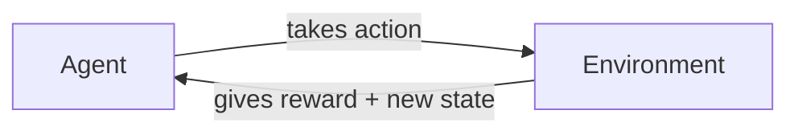

# Unit V — Reinforcement Learning

[⬅ Back to Index](README.md)

**In this unit:** what RL is → its components → MDPs → returns → value functions → Bellman equations → value iteration → TD learning → Q-Learning.

---

## 1. Fundamentals of Reinforcement Learning

> 💡 **In simple words:** An **agent** learns by **trial and error**. It tries actions, gets **rewards** (good) or **penalties** (bad), and slowly learns which actions lead to the most reward in the long run. Like training a dog with treats, or learning a video game by playing it.



**The loop at each step $t$:**
1. Agent sees the current **state** $s_t$.
2. Agent picks an **action** $a_t$.
3. Environment gives a **reward** $r_{t+1}$ and the **next state** $s_{t+1}$.

### How RL is Different

| | Supervised Learning | Reinforcement Learning |
|---|---|---|
| Feedback | Correct answer given | Only a reward (good/bad score) |
| Timing | Immediate | Often **delayed** (a chess move pays off 20 moves later) |
| Data | Fixed dataset | Created by the agent's own actions |
| Goal | Predict correctly | Maximise **total** reward |

**Applications:** game playing (AlphaGo, chess), robots, self-driving cars, recommendation systems, stock trading.

---

## 2. Components of RL

Example: a robot in a maze.

| Component | Meaning | Maze example |
|---|---|---|
| **Agent** | The learner / decision maker | The robot |
| **Environment** | Everything the agent interacts with | The maze |
| **State** ($s$) | Current situation | Robot's position |
| **Action** ($a$) | What the agent can do | Up / Down / Left / Right |
| **Reward** ($r$) | Immediate feedback number | +100 at exit, −1 per step |
| **Policy** ($\pi$) | Agent's strategy: which action in which state | "At (2,3), go Right" |
| **Value function** ($V$, $Q$) | Expected **total future** reward from a state | Cells near the exit have high value |
| **Model** (optional) | Agent's guess of how the environment works | Predicts the next position |

**Reward vs Value:** reward = *immediate* benefit; value = *long-term* benefit. A step can have a small reward but a high value if it leads towards the goal.

### Exploration vs Exploitation

- **Exploit:** choose the action you currently think is best.
- **Explore:** try something new — you might find something better.

**ε-greedy** (the most common strategy): with probability $\varepsilon$ pick a random action, otherwise pick the best action.

```math
P(\text{best action}) = 1 - \varepsilon + \frac{\varepsilon}{|A|} \qquad P(\text{each other action}) = \frac{\varepsilon}{|A|}
```

($\lvert A\rvert$ = number of actions.)

### 📝 Example 2.1 — ε-greedy

4 actions, $\varepsilon = 0.1$:

```math
P(\text{best}) = 1 - 0.1 + \frac{0.1}{4} = 0.925 \qquad P(\text{each other}) = \frac{0.1}{4} = 0.025
```

Check: $0.925 + 3 \times 0.025 = 1$ ✓

---

## 3. Markov Decision Process (MDP)

> 💡 **In simple words:** An MDP is the **mathematical description of an RL problem** — the states, actions, how actions change states, the rewards, and how much we care about the future.

### 3.1 Markov Property

> "The future depends **only on the present**, not on the past."

```math
P(s_{t+1} \mid s_t, a_t) = P(s_{t+1} \mid s_1, a_1, \dots, s_t, a_t)
```

Example: in chess, the current board position is enough to decide the next move — you don't need the history of how you got there.

### 3.2 Definition

An MDP has 5 parts $(S, A, P, R, \gamma)$:

| Part | Meaning |
|---|---|
| $S$ | Set of states |
| $A$ | Set of actions |
| $P(s' \mid s, a)$ | Probability of reaching state $s'$ after taking action $a$ in state $s$ |
| $R(s, a)$ | Reward for taking action $a$ in state $s$ |
| $\gamma$ | Discount factor, between 0 and 1 |

The probabilities from any state–action pair add up to 1: $\sum_{s'}P(s' \mid s, a) = 1$.

**Episodic tasks** end (a game); **continuing tasks** go on forever (a thermostat).

---

## 4. Return and Discounting

> 💡 The **return** is the total reward from now on. Future rewards are multiplied by $\gamma$ ("discounted") because a reward now is worth more than a reward later.

```math
G_t = r_{t+1} + \gamma r_{t+2} + \gamma^2 r_{t+3} + \dots = \sum_{k=0}^{\infty}\gamma^k r_{t+k+1}
```

**Useful recursive form:**

```math
G_t = r_{t+1} + \gamma G_{t+1}
```

- $\gamma = 0$ → only cares about the immediate reward (short-sighted).
- $\gamma$ close to 1 → cares about the far future (far-sighted).

If the reward is the same $r$ forever:

```math
G = \frac{r}{1 - \gamma}
```

### 📝 Example 4.1

Rewards 1, 2, 3, then the episode ends. $\gamma = 0.9$.

```math
G_0 = 1 + 0.9(2) + 0.9^2(3) = 1 + 1.8 + 2.43 = 5.23
```

### 📝 Example 4.2

Reward 1 forever, $\gamma = 0.9$: $G = \frac{1}{1 - 0.9} = 10$.

### 📝 Example 4.3 — Effect of γ

Rewards $(0, 0, 0, 10)$:
- $\gamma = 0.5$: $G = 0.5^3 \times 10 = 1.25$
- $\gamma = 0.9$: $G = 0.9^3 \times 10 = 7.29$

---

## 5. Policies and Value Functions

**Policy** $\pi$: the agent's strategy.
- Deterministic: $a = \pi(s)$
- Stochastic: $\pi(a \mid s)$ = probability of choosing $a$ in $s$

**State-value function** — "how good is it to be in state $s$?":

```math
V^\pi(s) = \mathbb{E}_\pi\left[G_t \mid s_t = s\right]
```

**Action-value function (Q-value)** — "how good is it to take action $a$ in state $s$?":

```math
Q^\pi(s, a) = \mathbb{E}_\pi\left[G_t \mid s_t = s, a_t = a\right]
```

**Links between them:**

```math
V^\pi(s) = \sum_a \pi(a \mid s)\,Q^\pi(s, a) \qquad Q^\pi(s, a) = R(s, a) + \gamma\sum_{s'}P(s' \mid s, a)\,V^\pi(s')
```

**Optimal** values and policy (the best possible):

```math
V^{\ast}(s) = \max_a Q^{\ast}(s, a) \qquad \pi^{\ast}(s) = \arg\max_a Q^{\ast}(s, a)
```

### 📝 Example 5.1 — Q from V

Action $a$ in state $s$: reward 5; goes to $s_1$ (value 10) with prob 0.7, or $s_2$ (value 20) with prob 0.3. $\gamma = 0.9$.

```math
Q(s, a) = 5 + 0.9\left[0.7 \times 10 + 0.3 \times 20\right] = 5 + 0.9 \times 13 = 16.7
```

---

## 6. Bellman Equations

> 💡 **In simple words:** **Value of a state = reward now + discounted value of where you go next.** This breaks a long-term problem into one step + the rest.

### 6.1 Bellman Expectation Equation (for a given policy)

```math
V^\pi(s) = \sum_a \pi(a \mid s)\left[R(s, a) + \gamma\sum_{s'}P(s' \mid s, a)\,V^\pi(s')\right]
```

```math
Q^\pi(s, a) = R(s, a) + \gamma\sum_{s'}P(s' \mid s, a)\sum_{a'}\pi(a' \mid s')\,Q^\pi(s', a')
```

### 6.2 Bellman Optimality Equation (for the best policy)

Replace "average over the policy" with "**take the best action**":

```math
V^{\ast}(s) = \max_a\left[R(s, a) + \gamma\sum_{s'}P(s' \mid s, a)\,V^{\ast}(s')\right]
```

```math
Q^{\ast}(s, a) = R(s, a) + \gamma\sum_{s'}P(s' \mid s, a)\max_{a'}Q^{\ast}(s', a')
```

### 📝 Example 6.1 — Solve Bellman Equations (2 states)

Fixed policy, $\gamma = 0.5$:

| From | Reward | Go to $s_1$ | Go to $s_2$ |
|---|---|---|---|
| $s_1$ | 2 | 0.5 | 0.5 |
| $s_2$ | 1 | 0.2 | 0.8 |

**Write the equations:**

```math
V_1 = 2 + 0.5\,(0.5V_1 + 0.5V_2) = 2 + 0.25V_1 + 0.25V_2
```

```math
V_2 = 1 + 0.5\,(0.2V_1 + 0.8V_2) = 1 + 0.1V_1 + 0.4V_2
```

**Rearrange:**

```math
0.75V_1 - 0.25V_2 = 2 \qquad\text{...(i)}
```

```math
-0.1V_1 + 0.6V_2 = 1 \qquad\text{...(ii)}
```

From (i): $V_1 = 2.667 + 0.333V_2$. Put into (ii): $-0.267 - 0.033V_2 + 0.6V_2 = 1 \Rightarrow 0.567V_2 = 1.267$

```math
V_2 = 2.235 \qquad V_1 = 2.667 + 0.333 \times 2.235 = 3.412
```

---

## 7. Solving MDPs: Value Iteration and Policy Iteration

(These need the full model — $P$ and $R$ must be known.)

### 7.1 Value Iteration

Start with all values = 0 and repeatedly apply the Bellman optimality equation:

```math
V_{k+1}(s) = \max_a\left[R(s, a) + \gamma\sum_{s'}P(s' \mid s, a)\,V_k(s')\right]
```

Stop when the values stop changing. Then pick the best action in each state.

### 7.2 Policy Iteration

1. **Evaluate:** compute $V^\pi$ for the current policy.
2. **Improve:** in each state choose the action that looks best using $V^\pi$.
3. Repeat until the policy stops changing.

| Value Iteration | Policy Iteration |
|---|---|
| Updates values directly with max | Alternates evaluate → improve |
| Many cheap iterations | Few expensive iterations |

### 📝 Example 7.1 — Value Iteration

A corridor: **A ↔ B → Goal**, $\gamma = 0.9$. Goal ends the episode ($V = 0$).

| State | Action | Goes to | Reward |
|---|---|---|---|
| A | Right | B | −1 |
| A | Left | A (wall) | −1 |
| B | Right | Goal | +10 |
| B | Left | A | −1 |

Start: $V(A) = V(B) = 0$.

**Iteration 1:**

```math
V(A) = \max[-1 + 0.9(0),\ -1 + 0.9(0)] = -1 \qquad V(B) = \max[10 + 0,\ -1 + 0.9(0)] = 10
```

**Iteration 2:**

```math
V(A) = \max[\underbrace{-1 + 0.9(10)}_{\text{Right}},\ \underbrace{-1 + 0.9(-1)}_{\text{Left}}] = \max[8,\ -1.9] = 8 \qquad V(B) = \max[10,\ -1.9] = 10
```

**Iteration 3:** $V(A) = \max[8,\ -1 + 0.9 \times 8] = 8$, $V(B) = 10$ → **no change, done!**

**Answer:** $V^{\ast}(A) = 8$, $V^{\ast}(B) = 10$. Best policy: go **Right** in both states.

---

## 8. Temporal Difference (TD) Learning

> 💡 **In simple words:** We usually **don't know** $P$ and $R$. TD learns directly from experience and updates its guess **after every single step** — it uses its own guess of the next state's value (called **bootstrapping**).

### 8.1 TD(0) Update

```math
V(s) \leftarrow V(s) + \alpha\left[\underbrace{r + \gamma V(s')}_{\text{TD target}} - V(s)\right]
```

**TD error** — "how surprised was I?":

```math
\delta = r + \gamma V(s') - V(s)
```

- $\alpha$ = learning rate (how big a step to take, e.g. 0.1).

### 8.2 Compare with Monte Carlo (MC)

MC waits until the **end of the episode** and uses the actual total return $G$:

```math
V(s) \leftarrow V(s) + \alpha\left[G - V(s)\right]
```

| | Dynamic Programming | Monte Carlo | TD Learning |
|---|---|---|---|
| Needs a model? | Yes | No | No |
| Updates when? | Sweeps over all states | End of episode | Every step |
| Uses own guesses? | Yes | No | Yes |
| Works for never-ending tasks? | Yes | No | Yes |

### 📝 Example 8.1 — TD(0) Update

$V(s) = 0.5$, $V(s') = 0.8$, reward $r = 1$, $\gamma = 0.9$, $\alpha = 0.1$.

```math
\delta = 1 + 0.9(0.8) - 0.5 = 1.22 \qquad V(s) = 0.5 + 0.1 \times 1.22 = 0.622
```

### 📝 Example 8.2 — TD vs MC

Episode: $A \xrightarrow{r = 0} B \xrightarrow{r = 1} \text{End}$. $V(A) = 0.2$, $V(B) = 0.5$, $\gamma = 1$, $\alpha = 0.5$.

**Monte Carlo** (actual return from A = 0 + 1 = 1):

```math
V(A) = 0.2 + 0.5(1 - 0.2) = 0.6
```

**TD(0)** (uses the current guess for B):

```math
V(A) = 0.2 + 0.5\left[0 + 1 \times 0.5 - 0.2\right] = 0.35
```

---

## 9. Q-Learning

> 💡 **In simple words:** Learn a **Q-table** — a score for every (state, action) pair. After each step, nudge the score toward "reward received + best score possible from the next state".

### 9.1 Update Rule

```math
Q(s, a) \leftarrow Q(s, a) + \alpha\left[r + \gamma\max_{a'}Q(s', a') - Q(s, a)\right]
```

### 9.2 Algorithm

```
Set all Q(s, a) = 0
For each episode:
    Start in state s
    Repeat until the episode ends:
        Pick action a using ε-greedy on Q
        Do a → get reward r and next state s'
        Q(s,a) ← Q(s,a) + α [ r + γ · max Q(s', ·) − Q(s,a) ]
        s ← s'
```

- **Off-policy:** it learns the *best* policy (uses max) even while exploring randomly.
- Converges to the optimal $Q^{\ast}$ if every state–action pair is tried many times and $\alpha$ is reduced slowly.

### 📝 Example 9.1 — One Update

$Q(s, a) = 0.5$, $r = 1$, $\max Q(s', \cdot) = 2$, $\alpha = 0.1$, $\gamma = 0.9$.

```math
Q(s, a) = 0.5 + 0.1\left[1 + 0.9 \times 2 - 0.5\right] = 0.5 + 0.1 \times 2.3 = 0.73
```

### 📝 Example 9.2 — Q-Learning over Episodes

Same corridor as Example 7.1. $\alpha = 0.5$, $\gamma = 0.9$, all Q = 0. The agent goes Right, Right each episode.

**Episode 1:**

```math
Q(A, R) = 0 + 0.5\left[-1 + 0.9 \times 0 - 0\right] = -0.5 \qquad Q(B, R) = 0 + 0.5\left[10 + 0 - 0\right] = 5
```

**Episode 2:**

```math
Q(A, R) = -0.5 + 0.5\left[-1 + 0.9 \times 5 - (-0.5)\right] = -0.5 + 2 = 1.5 \qquad Q(B, R) = 5 + 0.5(10 - 5) = 7.5
```

**Episode 3:**

```math
Q(A, R) = 1.5 + 0.5\left[-1 + 0.9 \times 7.5 - 1.5\right] = 3.625 \qquad Q(B, R) = 7.5 + 0.5(10 - 7.5) = 8.75
```

| Episode | Q(A, Right) | Q(B, Right) |
|---|---|---|
| 1 | −0.5 | 5 |
| 2 | 1.5 | 7.5 |
| 3 | 3.625 | 8.75 |
| … | → 8 | → 10 |

It slowly approaches the correct values from value iteration (8 and 10). 🎯

---

## 10. SARSA vs Q-Learning

**SARSA** (State–Action–Reward–State–Action) uses the action the agent **actually takes next**, not the best one:

```math
Q(s, a) \leftarrow Q(s, a) + \alpha\left[r + \gamma\,Q(s', a') - Q(s, a)\right]
```

| | SARSA | Q-Learning |
|---|---|---|
| Type | On-policy | Off-policy |
| Target uses | Next action actually taken | Best next action (max) |
| Behaviour | Safer, more careful | Bolder, learns the optimal path |

### 📝 Example 10.1 — Same Step, Two Methods

$Q(s, a) = 0.5$, $r = 1$, $\gamma = 0.9$, $\alpha = 0.1$. Next state: $Q(s', a_1) = 2$, $Q(s', a_2) = 1$. The agent explored and actually chose $a_2$.

```math
\text{Q-Learning (uses max = 2): } 0.5 + 0.1\left[1 + 0.9 \times 2 - 0.5\right] = 0.73
```

```math
\text{SARSA (uses } a_2 = 1\text{): } 0.5 + 0.1\left[1 + 0.9 \times 1 - 0.5\right] = 0.64
```

<details>
<summary>📘 Optional: n-step TD and TD(λ)</summary>

**n-step return** — look $n$ steps ahead, then use the estimate:

```math
G_t^{(n)} = r_{t+1} + \gamma r_{t+2} + \dots + \gamma^{n-1}r_{t+n} + \gamma^n V(s_{t+n})
```

$n = 1$ gives TD(0); $n = \infty$ gives Monte Carlo. **TD(λ)** averages all n-step returns with weights $(1-\lambda)\lambda^{n-1}$:

```math
G_t^\lambda = (1 - \lambda)\sum_{n=1}^{\infty}\lambda^{n-1}G_t^{(n)}
```

**Deep Q-Networks (DQN)** replace the Q-table with a neural network for huge state spaces (e.g. Atari games from pixels).

</details>

---

## ✅ Quick Revision

| Concept | Formula |
|---|---|
| Return | $G_t = r_{t+1} + \gamma r_{t+2} + \gamma^2 r_{t+3} + \dots$ |
| Recursive return | $G_t = r_{t+1} + \gamma G_{t+1}$ |
| Constant reward | $G = r/(1-\gamma)$ |
| ε-greedy | best: $1 - \varepsilon + \varepsilon/\lvert A\rvert$; others: $\varepsilon/\lvert A\rvert$ |
| State value | $V^\pi(s) = \mathbb{E}[G_t \mid s]$ |
| Q-value | $Q^\pi(s,a) = \mathbb{E}[G_t \mid s, a]$ |
| V from Q | $V(s) = \sum_a\pi(a\mid s)Q(s,a)$ |
| Q from V | $Q(s,a) = R + \gamma\sum_{s'}P(s'\mid s,a)V(s')$ |
| Bellman expectation | $V^\pi(s) = \sum_a\pi(a\mid s)[R + \gamma\sum_{s'}P\,V^\pi(s')]$ |
| Bellman optimality | $V^{\ast}(s) = \max_a[R + \gamma\sum_{s'}P\,V^{\ast}(s')]$ |
| TD(0) | $V(s) \leftarrow V(s) + \alpha[r + \gamma V(s') - V(s)]$ |
| TD error | $\delta = r + \gamma V(s') - V(s)$ |
| Monte Carlo | $V(s) \leftarrow V(s) + \alpha[G - V(s)]$ |
| Q-Learning | $Q \leftarrow Q + \alpha[r + \gamma\max Q(s',\cdot) - Q]$ |
| SARSA | $Q \leftarrow Q + \alpha[r + \gamma Q(s',a') - Q]$ |

**Likely exam questions:** Components of RL · Define MDP & Markov property · Bellman equations · Value iteration numerical · Q-Learning update numerical · TD vs MC · SARSA vs Q-Learning.

---

[⬅ Unit IV](Unit-4-Regression-and-Clustering.md) | [Back to Index](README.md) | [Next: Unit VI ➡](Unit-6-Model-Complexity-and-Optimization.md)
