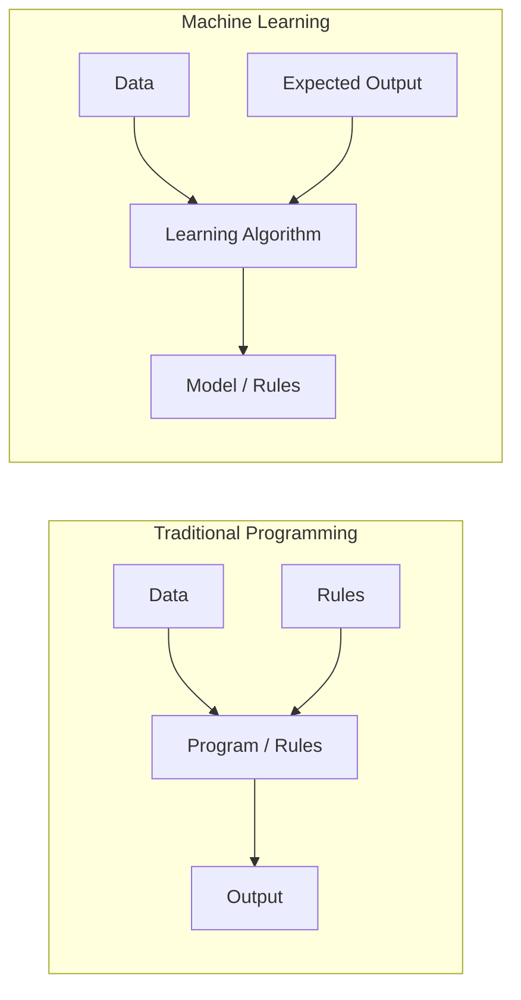
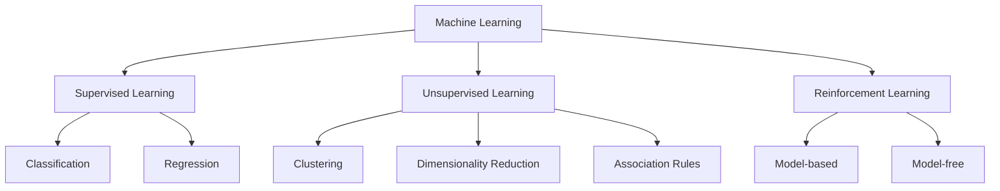

# Unit I — Foundations of Machine Learning

[⬅ Back to Index](README.md)

## Contents
1. [Definition of Machine Learning](#1-definition-of-machine-learning)
2. [Scope and Need of Machine Learning](#2-scope-and-need-of-machine-learning)
3. [Types of Learning](#3-types-of-learning)
4. [Challenges in Machine Learning](#4-challenges-in-machine-learning)
5. [Statistical Learning Framework](#5-statistical-learning-framework)
6. [Empirical Risk Minimization (ERM)](#6-empirical-risk-minimization-erm)
7. [Inductive Bias](#7-inductive-bias)
8. [PAC Learning](#8-probably-approximately-correct-pac-learning)
9. [Formula Sheet](#9-formula-sheet)

---

## 1. Definition of Machine Learning

**Arthur Samuel (1959):** Machine Learning is the field of study that gives computers the ability to learn without being explicitly programmed.

**Tom Mitchell (1997) — formal definition:**

> A computer program is said to **learn** from experience **E** with respect to some class of tasks **T** and performance measure **P**, if its performance at tasks in T, as measured by P, improves with experience E.

| Example | Task (T) | Performance (P) | Experience (E) |
|---|---|---|---|
| Spam filter | Classify emails as spam / not spam | % of emails correctly classified | Emails labelled by users |
| Chess program | Playing chess | % of games won | Games played against itself |
| Handwriting recognition | Recognise handwritten digits | Accuracy on test images | Database of labelled digit images |
| Self-driving car | Driving on roads | Average distance before an error | Recorded sensor data + human driving |

### Traditional Programming vs Machine Learning



- **Traditional:** Data + Rules → Output
- **ML:** Data + Output → Rules (the model)

---

## 2. Scope and Need of Machine Learning

### 2.1 Why do we need ML? (Need)

1. **Tasks too complex to program by hand** — e.g., recognising faces, understanding speech. Humans do these easily but cannot write down the rules.
2. **Tasks beyond human capability** — analysing huge datasets (astronomy, genomics, web logs) to find hidden patterns.
3. **Adaptivity** — rules change over time (spam patterns, user preferences, stock trends). An ML model can be retrained, a hand-written program must be rewritten.
4. **Personalisation** — recommendations for millions of users, each different.
5. **Availability of data and compute** — massive data + GPUs make learning practical.

### 2.2 Scope (Applications)

| Domain | Applications |
|---|---|
| Healthcare | Disease diagnosis, medical image analysis, drug discovery |
| Finance | Fraud detection, credit scoring, algorithmic trading |
| E-commerce | Recommendation systems, demand forecasting, dynamic pricing |
| NLP | Machine translation, chatbots, sentiment analysis |
| Computer Vision | Face recognition, object detection, autonomous vehicles |
| Agriculture | Crop yield prediction, disease detection in plants |
| Cybersecurity | Intrusion detection, malware classification |
| Robotics / Games | Robot control, game playing (AlphaGo) |

---

## 3. Types of Learning



### 3.1 Supervised Learning

The training data contains **input–output pairs** (labelled data):

```math
S = \lbrace (x_1, y_1), (x_2, y_2), \dots, (x_m, y_m) \rbrace
```

The goal is to learn a function $h : \mathcal{X} \rightarrow \mathcal{Y}$ such that $h(x) \approx y$ for new, unseen $x$.

- **Classification:** $\mathcal{Y}$ is discrete (e.g., spam / not spam, digit 0–9).
- **Regression:** $\mathcal{Y}$ is continuous (e.g., house price, temperature).

**Algorithms:** Linear/Logistic Regression, KNN, Decision Trees, SVM, Naïve Bayes, Neural Networks.

### 3.2 Unsupervised Learning

The data has **no labels**: $S = \lbrace x_1, x_2, \dots, x_m \rbrace$. The goal is to discover hidden structure.

- **Clustering:** group similar points (customer segmentation). Algorithms: K-Means, Hierarchical, DBSCAN.
- **Dimensionality reduction:** compress features (PCA, t-SNE).
- **Association rule mining:** "people who buy bread also buy butter" (Apriori).
- **Density estimation / anomaly detection.**

### 3.3 Reinforcement Learning

An **agent** interacts with an **environment**. At each step it observes a state $s_t$, takes an action $a_t$, receives a reward $r_{t+1}$ and moves to $s_{t+1}$. The goal is to learn a **policy** $\pi(a \mid s)$ that maximises total (discounted) reward:

```math
G_t = r_{t+1} + \gamma r_{t+2} + \gamma^2 r_{t+3} + \dots = \sum_{k=0}^{\infty} \gamma^k r_{t+k+1}
```

Examples: game playing, robot navigation, self-driving, resource scheduling. (Covered in detail in Unit V.)

### 3.4 Comparison Table

| Aspect | Supervised | Unsupervised | Reinforcement |
|---|---|---|---|
| Data | Labelled $(x, y)$ | Unlabelled $x$ | No fixed dataset; experience via interaction |
| Feedback | Correct answer given | No feedback | Delayed scalar reward |
| Goal | Predict labels | Find structure | Maximise cumulative reward |
| Examples | Spam detection, price prediction | Customer segmentation | Game playing, robotics |
| Algorithms | SVM, Decision Tree, Regression | K-Means, PCA | Q-Learning, SARSA |

> **Other types (for completeness):** *Semi-supervised* (few labels + many unlabelled), *Self-supervised* (labels created from the data itself, e.g., predict the next word).

---

## 4. Challenges in Machine Learning

| # | Challenge | Explanation | Remedy |
|---|---|---|---|
| 1 | **Insufficient training data** | Most algorithms need thousands of examples | Collect more data, data augmentation, transfer learning |
| 2 | **Non-representative data** | Training data does not reflect real-world distribution (sampling bias) | Careful, random, stratified sampling |
| 3 | **Poor-quality data** | Noise, outliers, missing values, wrong labels | Data cleaning, imputation, outlier removal |
| 4 | **Irrelevant features** | Garbage in, garbage out | Feature selection, feature engineering |
| 5 | **Overfitting** | Model memorises training data, fails on new data | Regularization, more data, simpler model, pruning, CV |
| 6 | **Underfitting** | Model too simple to capture patterns | More complex model, better features, less regularization |
| 7 | **Curse of dimensionality** | With many features, data becomes sparse; distances lose meaning | PCA, feature selection |
| 8 | **Class imbalance** | e.g., 99% non-fraud, 1% fraud | Resampling (SMOTE), class weights, proper metrics (F1, AUC) |
| 9 | **Computational cost** | Training large models is expensive | Efficient algorithms, GPUs, distributed training |
| 10 | **Interpretability** | Complex models (deep nets) are black boxes | Simpler models, SHAP, LIME |
| 11 | **Concept drift** | Data distribution changes over time | Periodic retraining, online learning |
| 12 | **Bias and fairness** | Model learns societal bias present in data | Fairness-aware training, audits |

### Curse of Dimensionality — a quick numerical

Suppose we want to cover 10% of the range of each feature in a unit hypercube. To capture a fraction $r$ of the total volume with a sub-cube in $d$ dimensions, the edge length needed is:

```math
e_d(r) = r^{1/d}
```

For $r = 0.1$ (10% of the data):
- $d = 1$: $e = 0.1$
- $d = 10$: $e = 0.1^{0.1} = 0.794$
- $d = 100$: $e = 0.1^{0.01} = 0.977$

So in 10 dimensions, to capture just 10% of the data, a "local" neighbourhood must span **79.4% of each axis** — it is no longer local.

---

## 5. Statistical Learning Framework

This is the formal model (from Shalev-Shwartz & Ben-David) used to analyse learning.

### 5.1 Components

| Component | Symbol | Description |
|---|---|---|
| Domain set | $\mathcal{X}$ | Set of all possible inputs (e.g., all papayas described by colour and softness) |
| Label set | $\mathcal{Y}$ | Set of possible labels, e.g., $\lbrace 0, 1 \rbrace$ or $\lbrace -1, +1 \rbrace$ |
| Training data | $S$ | $S = ((x_1,y_1), \dots, (x_m,y_m))$, a finite sequence of labelled examples |
| Data distribution | $\mathcal{D}$ | Unknown probability distribution over $\mathcal{X}$ (or over $\mathcal{X}\times\mathcal{Y}$) |
| Labelling function | $f$ | True (unknown) function $f: \mathcal{X}\rightarrow\mathcal{Y}$ with $y_i = f(x_i)$ |
| Learner's output | $h$ | Hypothesis / predictor / classifier $h: \mathcal{X}\rightarrow\mathcal{Y}$ |
| Hypothesis class | $\mathcal{H}$ | Set of hypotheses the learner is allowed to choose from |

**Key assumption:** the training examples are drawn **i.i.d.** (independently and identically distributed) from $\mathcal{D}$.

### 5.2 Loss Function

A loss function $\ell(h, (x, y))$ measures how bad the prediction $h(x)$ is for the true label $y$.

**0–1 loss (classification):**

```math
\ell_{0\text{-}1}(h,(x,y)) = \begin{cases} 0 & \text{if } h(x) = y \\ 1 & \text{if } h(x) \neq y \end{cases}
```

**Squared loss (regression):**

```math
\ell_{sq}(h,(x,y)) = (h(x) - y)^2
```

### 5.3 True Risk (Generalization Error)

The expected loss over the true distribution — this is what we really want to minimise, but we cannot compute it because $\mathcal{D}$ is unknown:

```math
L_{\mathcal{D}}(h) = \mathbb{E}_{(x,y)\sim\mathcal{D}}\left[\ell(h,(x,y))\right]
```

For 0–1 loss with a true labelling function $f$:

```math
L_{\mathcal{D},f}(h) = \Pr_{x\sim\mathcal{D}}\left[h(x) \neq f(x)\right]
```

### 5.4 Empirical Risk (Training Error)

The average loss on the training sample — this we **can** compute:

```math
L_S(h) = \frac{1}{m}\sum_{i=1}^{m} \ell(h,(x_i,y_i))
```

For 0–1 loss:

```math
L_S(h) = \frac{\left| \lbrace i \in [m] : h(x_i) \neq y_i \rbrace \right|}{m}
```

### 5.5 Generalization Gap

```math
\text{Generalization gap} = L_{\mathcal{D}}(h) - L_S(h)
```

A good learner keeps both $L_S(h)$ and the gap small.

### 📝 Solved Numerical 1.1 — Computing Empirical Risk

A classifier $h$ is tested on 8 training examples:

| $i$ | 1 | 2 | 3 | 4 | 5 | 6 | 7 | 8 |
|---|---|---|---|---|---|---|---|---|
| True $y_i$ | 1 | 0 | 1 | 1 | 0 | 0 | 1 | 0 |
| Predicted $h(x_i)$ | 1 | 0 | 0 | 1 | 0 | 1 | 1 | 0 |

Compute the empirical risk under 0–1 loss.

**Solution:**

Mismatches occur at $i = 3$ (true 1, predicted 0) and $i = 6$ (true 0, predicted 1).

```math
L_S(h) = \frac{1}{8}\sum_{i=1}^{8} \mathbb{1}[h(x_i)\neq y_i] = \frac{0+0+1+0+0+1+0+0}{8} = \frac{2}{8} = 0.25
```

Training accuracy $= 1 - 0.25 = 0.75$ (75%).

### 📝 Solved Numerical 1.2 — Empirical Risk with Squared Loss

A regressor predicts $\hat{y} = (2.5, 3.0, 4.5, 6.0)$ for true values $y = (3, 3, 5, 5)$.

```math
L_S(h) = \frac{1}{4}\left[(2.5-3)^2 + (3-3)^2 + (4.5-5)^2 + (6-5)^2\right] = \frac{0.25 + 0 + 0.25 + 1}{4} = \frac{1.5}{4} = 0.375
```

---

## 6. Empirical Risk Minimization (ERM)

### 6.1 The ERM Principle

Since the true risk is unknown, choose the hypothesis that minimises the **training error**:

```math
h_S = \text{ERM}(S) \in \arg\min_{h} L_S(h)
```

### 6.2 ERM Can Overfit — The Memorising Predictor

**Papaya example:** Suppose the domain is a square, tasty papayas lie inside a smaller square of area 1/2, and $\mathcal{D}$ is uniform. Consider the predictor:

```math
h_S(x) = \begin{cases} y_i & \text{if } \exists\, i \text{ such that } x_i = x \\ 0 & \text{otherwise} \end{cases}
```

- On training data: $L_S(h_S) = 0$ (it memorised every example) — ERM will happily pick it.
- On new data: it predicts 0 for every unseen point, so it is wrong on all tasty papayas: $L_{\mathcal{D}}(h_S) = 1/2$.

**Conclusion:** Minimising training error alone leads to **overfitting**. We need to restrict the search space.

### 6.3 ERM with Inductive Bias

Restrict the learner to a hypothesis class $\mathcal{H}$ chosen **before** seeing the data:

```math
\text{ERM}_{\mathcal{H}}(S) \in \arg\min_{h\in\mathcal{H}} L_S(h)
```

This restriction is called an **inductive bias**. For example, $\mathcal{H}$ = "axis-aligned rectangles" would prevent the memorising predictor.

### 6.4 Finite Hypothesis Classes — ERM Guarantee

**Realizability assumption:** there exists $h^{\ast} \in \mathcal{H}$ with $L_{\mathcal{D},f}(h^{\ast}) = 0$.

**Theorem:** Let $\mathcal{H}$ be finite, $\delta \in (0,1)$, $\epsilon > 0$, and

```math
m \geq \frac{\ln\left(|\mathcal{H}|/\delta\right)}{\epsilon}
```

Then, for any $f$ and $\mathcal{D}$ satisfying realizability, with probability at least $1-\delta$ over the choice of an i.i.d. sample $S$ of size $m$, every ERM hypothesis satisfies:

```math
L_{\mathcal{D},f}(h_S) \leq \epsilon
```

**Proof sketch:**
1. Call $h$ "bad" if $L_{\mathcal{D},f}(h) > \epsilon$. Let $\mathcal{H}_B$ = set of bad hypotheses.
2. A bad $h$ agrees with one random example with probability $\leq 1-\epsilon$, so it is consistent with all $m$ examples with probability $\leq (1-\epsilon)^m \leq e^{-\epsilon m}$ (using $1 - x \leq e^{-x}$).
3. By the union bound over all bad hypotheses:

```math
\Pr[\exists h\in\mathcal{H}_B \text{ consistent with } S] \leq |\mathcal{H}_B|\, e^{-\epsilon m} \leq |\mathcal{H}|\, e^{-\epsilon m}
```

4. Setting $|\mathcal{H}| e^{-\epsilon m} \leq \delta$ and solving for $m$ gives the bound above.

---

## 7. Inductive Bias

### 7.1 Definition

**Inductive bias** is the set of **assumptions** a learning algorithm makes to generalise from finite training data to unseen data. Without any inductive bias, learning is impossible — this is formalised by the **No-Free-Lunch theorem**: no single learner works best for all possible problems.

### 7.2 Types

| Type | Meaning | Example |
|---|---|---|
| **Restriction (language) bias** | Limits which hypotheses can be represented | Linear regression can only represent straight lines/hyperplanes |
| **Preference (search) bias** | Prefers some hypotheses over others within the space | ID3 prefers shorter trees; regularization prefers small weights |

### 7.3 Inductive Bias of Common Algorithms

| Algorithm | Inductive Bias |
|---|---|
| Linear Regression | Relationship between input and output is linear |
| Logistic Regression / Perceptron | Classes are linearly separable |
| KNN | Nearby points (small distance) have similar labels |
| Decision Tree (ID3) | Shorter trees preferred; high-information-gain attributes near root (Occam's razor) |
| Naïve Bayes | Features are conditionally independent given the class |
| SVM | Maximum-margin separator generalises best |
| CNN | Translation invariance, locality of features |

### 7.4 Bias–Complexity Tradeoff

Decompose the error of an ERM hypothesis:

```math
L_{\mathcal{D}}(h_S) = \underbrace{\epsilon_{app}}_{\text{approximation error}} + \underbrace{\epsilon_{est}}_{\text{estimation error}}
```

```math
\epsilon_{app} = \min_{h\in\mathcal{H}} L_{\mathcal{D}}(h), \qquad \epsilon_{est} = L_{\mathcal{D}}(h_S) - \epsilon_{app}
```

- **Approximation error:** how well the best hypothesis in $\mathcal{H}$ can do. Decreases as $\mathcal{H}$ becomes richer.
- **Estimation error:** extra error because we picked $h_S$ from finite data. Increases as $\mathcal{H}$ becomes richer (and decreases with more data).
- Rich $\mathcal{H}$ → overfitting; very small $\mathcal{H}$ → underfitting (too much bias).

💡 **Exam tip:** "Why is inductive bias necessary?" — because without assumptions, any labelling of unseen points is equally consistent with training data (No-Free-Lunch), so the learner has no basis for prediction.

---

## 8. Probably Approximately Correct (PAC) Learning

Introduced by **Leslie Valiant (1984)**.

### 8.1 Meaning of the Name

- **Approximately Correct:** the learned hypothesis has error at most $\epsilon$ (accuracy parameter).
- **Probably:** this happens with probability at least $1-\delta$ (confidence parameter), because the training sample is random and might be unrepresentative.

### 8.2 Definition (Realizable PAC Learnability)

A hypothesis class $\mathcal{H}$ is **PAC learnable** if there exist a function $m_{\mathcal{H}}:(0,1)^2\rightarrow\mathbb{N}$ and a learning algorithm $A$ such that:

For every $\epsilon, \delta \in (0,1)$, every distribution $\mathcal{D}$ over $\mathcal{X}$, and every labelling function $f$ (with realizability holding), when $A$ runs on $m \geq m_{\mathcal{H}}(\epsilon,\delta)$ i.i.d. examples, it returns $h$ such that:

```math
\Pr_{S\sim\mathcal{D}^m}\left[L_{\mathcal{D},f}(h) \leq \epsilon\right] \geq 1 - \delta
```

$m_{\mathcal{H}}(\epsilon,\delta)$ is the **sample complexity** — the number of examples needed.

### 8.3 Sample Complexity of Finite Classes (Realizable)

```math
m_{\mathcal{H}}(\epsilon,\delta) \leq \left\lceil \frac{\ln(|\mathcal{H}|/\delta)}{\epsilon} \right\rceil = \left\lceil \frac{1}{\epsilon}\left(\ln|\mathcal{H}| + \ln\frac{1}{\delta}\right) \right\rceil
```

**Observations:**
- $m$ grows as $1/\epsilon$ (higher accuracy → more data).
- $m$ grows only as $\ln(1/\delta)$ (higher confidence is cheap).
- $m$ grows as $\ln|\mathcal{H}|$ (bigger class → more data, but only logarithmically).

### 8.4 Agnostic PAC Learning

Drop the realizability assumption — labels may be noisy and no perfect $h$ exists. The data is drawn from $\mathcal{D}$ over $\mathcal{X}\times\mathcal{Y}$. Now we only ask to be close to the **best** hypothesis in the class:

```math
\Pr_{S\sim\mathcal{D}^m}\left[L_{\mathcal{D}}(h) \leq \min_{h'\in\mathcal{H}} L_{\mathcal{D}}(h') + \epsilon\right] \geq 1 - \delta
```

**Uniform convergence + Hoeffding's inequality.** For a single fixed $h$ with loss in $[0,1]$:

```math
\Pr\left[\,|L_S(h) - L_{\mathcal{D}}(h)| > \epsilon\,\right] \leq 2\exp(-2m\epsilon^2)
```

Union bound over $\mathcal{H}$ gives uniform convergence with $\epsilon$-accuracy when:

```math
m_{\mathcal{H}}^{UC}(\epsilon,\delta) \leq \left\lceil \frac{\ln(2|\mathcal{H}|/\delta)}{2\epsilon^2} \right\rceil
```

and hence agnostic PAC sample complexity:

```math
m_{\mathcal{H}}(\epsilon,\delta) \leq m_{\mathcal{H}}^{UC}(\epsilon/2,\delta) \leq \left\lceil \frac{2\ln(2|\mathcal{H}|/\delta)}{\epsilon^2} \right\rceil
```

Note the dependence is now $1/\epsilon^2$ instead of $1/\epsilon$ — agnostic learning needs much more data.

### 8.5 Error Bound Form (solving for $\epsilon$)

With probability at least $1-\delta$, for all $h\in\mathcal{H}$ (finite class):

```math
L_{\mathcal{D}}(h) \leq L_S(h) + \sqrt{\frac{\ln|\mathcal{H}| + \ln(2/\delta)}{2m}}
```

### 📝 Solved Numerical 1.3 — Realizable Sample Complexity

A finite hypothesis class has $|\mathcal{H}| = 1000$. How many examples guarantee error $\leq 5\%$ with confidence 99%?

**Given:** $\epsilon = 0.05$, $\delta = 0.01$.

```math
m \geq \frac{\ln(1000/0.01)}{0.05} = \frac{\ln(10^5)}{0.05} = \frac{11.5129}{0.05} = 230.26
```

**Answer:** $m = 231$ examples.

### 📝 Solved Numerical 1.4 — Agnostic Sample Complexity

Same class, same $\epsilon$ and $\delta$, but in the agnostic setting.

```math
m \geq \frac{2\ln(2\cdot 1000/0.01)}{(0.05)^2} = \frac{2\ln(2\times 10^5)}{0.0025} = \frac{2 \times 12.2061}{0.0025} = 9764.86
```

**Answer:** $m = 9765$ examples — about **42 times more** than the realizable case.

### 📝 Solved Numerical 1.5 — Conjunctions of Boolean Literals

Hypotheses are conjunctions over $n = 10$ Boolean variables (e.g., $x_1 \wedge \neg x_3 \wedge x_7$). Each variable can appear positive, negated, or be absent, so $|\mathcal{H}| = 3^{n}$ (plus the always-false hypothesis, negligible). Find $m$ for $\epsilon = 0.1$, $\delta = 0.05$.

```math
m \geq \frac{1}{\epsilon}\left(n\ln 3 + \ln\frac{1}{\delta}\right) = \frac{1}{0.1}\left(10 \times 1.0986 + \ln 20\right) = 10\,(10.986 + 2.996) = 139.82
```

**Answer:** $m = 140$ examples. Since $m$ is polynomial in $n$, $1/\epsilon$, $\ln(1/\delta)$, conjunctions are **efficiently PAC learnable**.

### 📝 Solved Numerical 1.6 — Finding the Error Bound

$|\mathcal{H}| = 500$, $m = 2000$, $\delta = 0.05$. A hypothesis has training error $L_S(h) = 0.08$. Bound its true error (agnostic, finite class).

```math
\sqrt{\frac{\ln 500 + \ln(2/0.05)}{2 \times 2000}} = \sqrt{\frac{6.2146 + 3.6889}{4000}} = \sqrt{\frac{9.9035}{4000}} = \sqrt{0.002476} = 0.0498
```

```math
L_{\mathcal{D}}(h) \leq 0.08 + 0.0498 = 0.1298
```

With 95% confidence, the true error is at most about **13%**.

### 📝 Solved Numerical 1.7 — How much does confidence cost?

For $|\mathcal{H}| = 1000$, $\epsilon = 0.05$ (realizable), compare $\delta = 0.1$ vs $\delta = 0.001$:

```math
\delta = 0.1: \quad m \geq \frac{\ln 1000 + \ln 10}{0.05} = \frac{6.9078 + 2.3026}{0.05} = 184.2 \rightarrow 185
```

```math
\delta = 0.001: \quad m \geq \frac{6.9078 + 6.9078}{0.05} = 276.3 \rightarrow 277
```

Going from 90% to 99.9% confidence only increases $m$ from 185 to 277 — confidence is cheap (logarithmic).

💡 **Exam tip:** Always round **up** the sample size (ceiling). Remember: realizable → $1/\epsilon$; agnostic → $1/\epsilon^2$.

---

## 9. Formula Sheet

| Concept | Formula |
|---|---|
| Discounted return | $G_t = \sum_{k=0}^{\infty}\gamma^k r_{t+k+1}$ |
| 0–1 loss | $\ell(h,(x,y)) = \mathbb{1}[h(x)\neq y]$ |
| Squared loss | $\ell(h,(x,y)) = (h(x)-y)^2$ |
| True risk | $L_{\mathcal{D}}(h) = \mathbb{E}_{(x,y)\sim\mathcal{D}}[\ell(h,(x,y))]$ |
| Empirical risk | $L_S(h) = \frac{1}{m}\sum_{i=1}^m \ell(h,(x_i,y_i))$ |
| ERM | $h_S \in \arg\min_{h\in\mathcal{H}} L_S(h)$ |
| Error decomposition | $L_{\mathcal{D}}(h_S) = \epsilon_{app} + \epsilon_{est}$ |
| PAC (realizable, finite) | $m \geq \frac{1}{\epsilon}\left(\ln\lvert\mathcal{H}\rvert + \ln\frac{1}{\delta}\right)$ |
| Hoeffding | $\Pr[\lvert L_S(h)-L_{\mathcal{D}}(h)\rvert > \epsilon] \leq 2e^{-2m\epsilon^2}$ |
| Uniform convergence | $m \geq \frac{\ln(2\lvert\mathcal{H}\rvert/\delta)}{2\epsilon^2}$ |
| Agnostic PAC (finite) | $m \geq \frac{2\ln(2\lvert\mathcal{H}\rvert/\delta)}{\epsilon^2}$ |
| Generalization bound | $L_{\mathcal{D}}(h) \leq L_S(h) + \sqrt{\frac{\ln\lvert\mathcal{H}\rvert + \ln(2/\delta)}{2m}}$ |
| Curse of dimensionality | $e_d(r) = r^{1/d}$ |

---

[⬅ Back to Index](README.md) | [Next: Unit II ➡](Unit-2-Classification.md)
